# 📚 Лабораторная работа №2

## Введение в WordPress

**Docker • Docker Compose • WordPress • MySQL • phpMyAdmin**

---

### 📋 Студент

| Параметр              | Значение                                                       |
| --------------------- | -------------------------------------------------------------- |
| **Имя и фамилия**     | Савка Никита (Savca Nichita)                                   |
| **Группа**            | I2302                                                          |
| **Рабочая станция**   | macOS (MacBook Air, Apple Silicon M3)                          |
| **Среда выполнения**  | Docker Desktop, Docker Compose, браузер, WordPress, phpMyAdmin |
| **Формат выполнения** | Локальная установка WordPress в контейнерах Docker             |
| **Дата выполнения**   | 14.03.2026                                                     |

---

## 🎯 Цель работы

Целью данной лабораторной работы было освоение базовых принципов установки и первоначальной настройки WordPress в локальной среде, а также знакомство с административной панелью системы, темами оформления, плагинами и основами управления контентом.

**В рамках выполнения лабораторной работы я должен был:**

- подготовить локальную среду для запуска WordPress;
- установить WordPress и подключить его к базе данных;
- выполнить базовые настройки сайта;
- изменить внешний вид сайта с помощью темы;
- расширить функциональность WordPress с помощью плагинов;
- создать страницу и записи с контентом;
- проверить отображение созданного контента на сайте.

---

## 📝 Краткое описание выполненной работы

В ходе выполнения лабораторной работы я развернул локальную среду для WordPress с использованием Docker, что позволило избежать установки XAMPP или MAMP на основную систему. После запуска контейнеров с WordPress, MySQL и phpMyAdmin я создал и проверил базу данных, установил WordPress через браузер, выполнил базовые настройки сайта, установил тему Astra, подключил плагины Classic Editor и Contact Form 7, а затем создал страницу «Контакты» и несколько записей в блоге. На каждом ключевом этапе были сделаны скриншоты для дальнейшего включения в отчёт.

---

## 🛠️ Используемые технологии и инструменты

**В процессе выполнения лабораторной работы были использованы следующие инструменты и технологии:**

- macOS на MacBook Air M3;
- Docker Desktop для локального запуска контейнеров;
- Docker Compose для описания и запуска сервисов;
- WordPress как система управления контентом;
- MySQL как система управления базами данных;
- phpMyAdmin для просмотра и управления базой данных;
- веб-браузер для выполнения установки и настройки WordPress.

---

## 🔧 Ход выполнения лабораторной работы

### 1️⃣ Подготовка локальной среды

На первом этапе я подготовил локальную среду для работы с WordPress. Вместо XAMPP или MAMP я использовал Docker, так как этот вариант также допускается в задании и более удобен для работы на macOS.

Я создал отдельную рабочую директорию для лабораторной работы и подготовил файл docker-compose.yml, в котором были описаны три сервиса:

- контейнер с MySQL для базы данных;
- контейнер с WordPress;
- контейнер с phpMyAdmin для управления базой данных через браузер.

После этого я запустил контейнеры с помощью команды:

```bash
docker compose up -d
```

После успешного запуска я убедился, что все сервисы работают корректно, а контейнеры находятся в состоянии running.

> 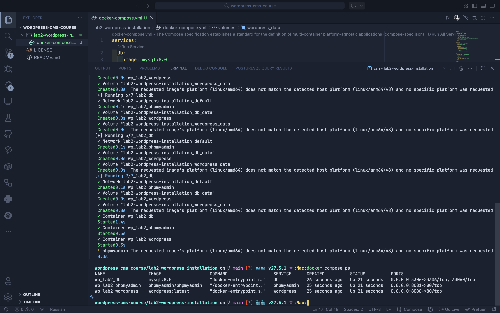
> **Скриншот 1** — Запущенные Docker-контейнеры WordPress, MySQL и phpMyAdmin в терминале.

---

### 2️⃣ Проверка доступности WordPress и phpMyAdmin

После запуска контейнеров я открыл в браузере локальные адреса сервисов:

- `http://localhost:8080` — для WordPress;
- `http://localhost:8081` — для phpMyAdmin.

По адресу WordPress отобразилась начальная страница установки системы, а по адресу phpMyAdmin — форма входа в систему управления базой данных. Это подтвердило, что локальная среда работает корректно.

> 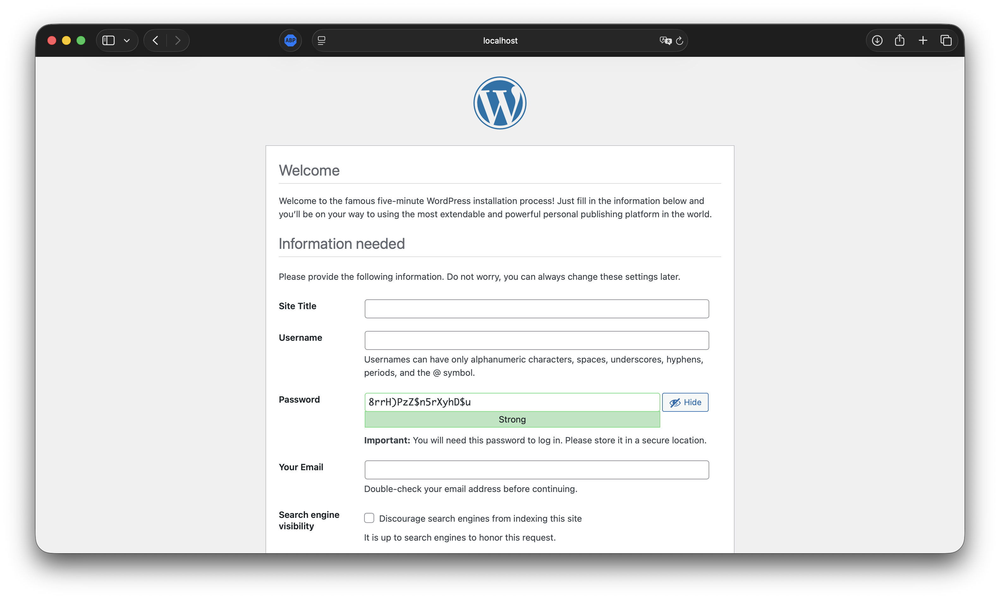
> **Скриншот 2** — Начальная страница установки WordPress в браузере.

---

### 3️⃣ Создание базы данных

Следующим шагом я открыл phpMyAdmin и вошёл в систему под пользователем root. После входа я проверил наличие базы данных wp_lab2. При необходимости её можно было создать вручную, однако в моей конфигурации она уже была подготовлена через параметры Docker Compose.

Я убедился, что база данных wp_lab2 существует и готова к использованию WordPress.

> 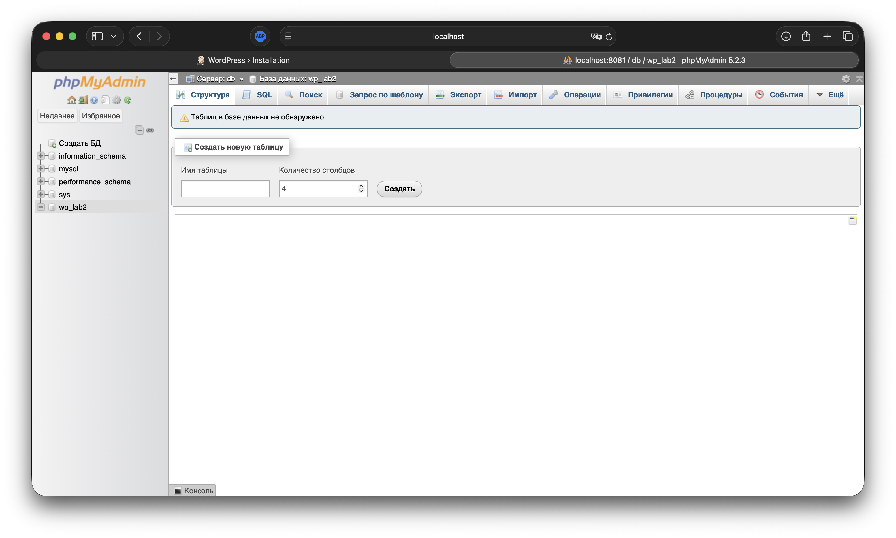
> **Скриншот 3** — База данных wp_lab2, созданная и отображаемая в phpMyAdmin.

---

### 4️⃣ Установка WordPress

После подготовки базы данных я перешёл к установке WordPress. Для этого я открыл страницу установки WordPress в браузере и прошёл стандартный процесс первоначальной настройки.

На этапе установки я задал:

- название сайта;
- имя администратора;
- пароль;
- адрес электронной почты;
- язык интерфейса.

После заполнения формы я завершил установку и вошёл в административную панель WordPress под созданной учётной записью администратора.

> 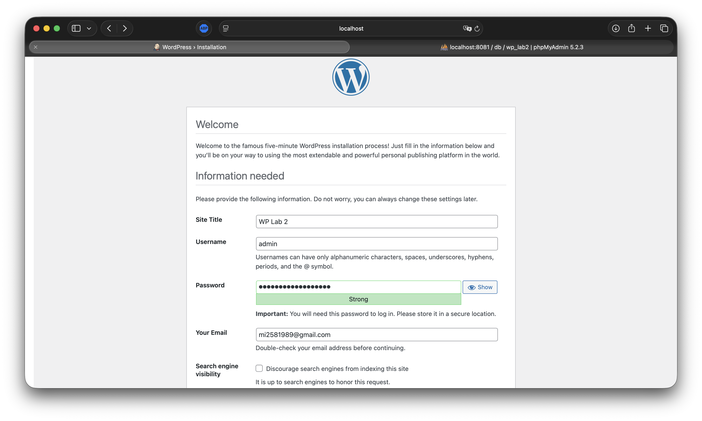
> **Скриншот 4** — Форма установки WordPress с заполненными параметрами сайта.

> 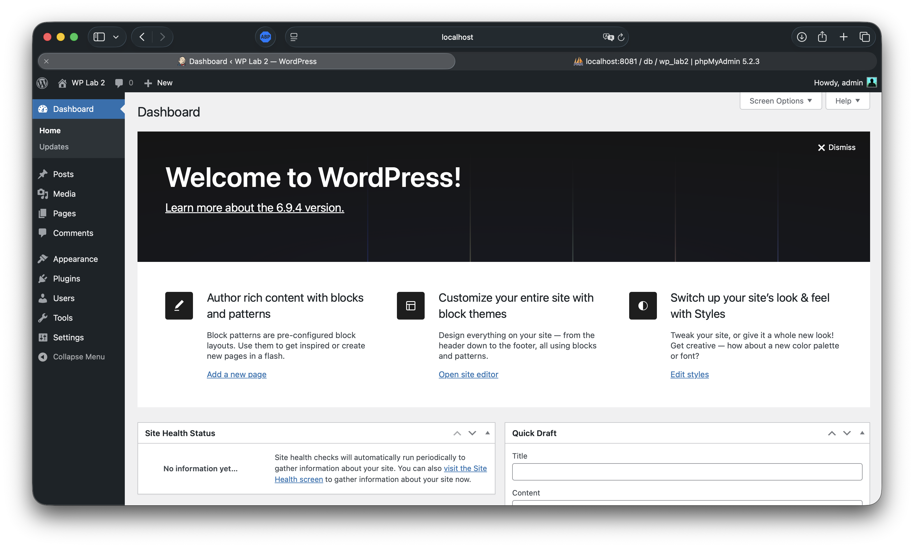
> **Скриншот 5** — Административная панель WordPress после завершения установки.

---

### 5️⃣ Первоначальные настройки сайта

После установки WordPress я выполнил базовые настройки сайта. Для этого в административной панели я открыл раздел Settings → General и изменил основные параметры сайта:

- название сайта;
- краткое описание;
- часовой пояс.

Эти настройки необходимы для корректного отображения информации на сайте и правильной работы публикаций по времени.

Затем я открыл раздел Settings → Permalinks и изменил формат постоянных ссылок на вариант Post name, чтобы адреса страниц и записей были более понятными и читаемыми.

> 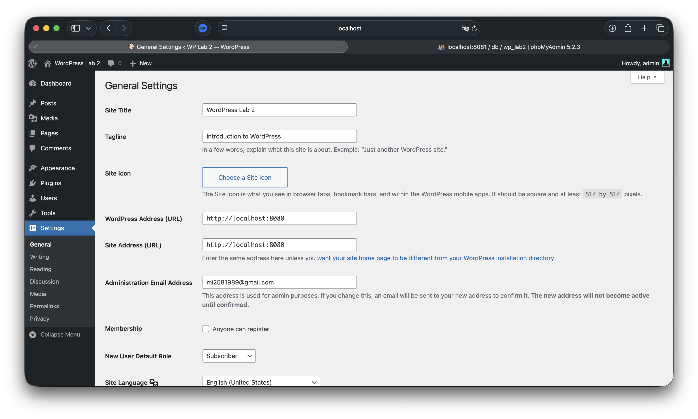
> **Скриншот 6** — Раздел Settings → General с изменёнными основными параметрами сайта.

> 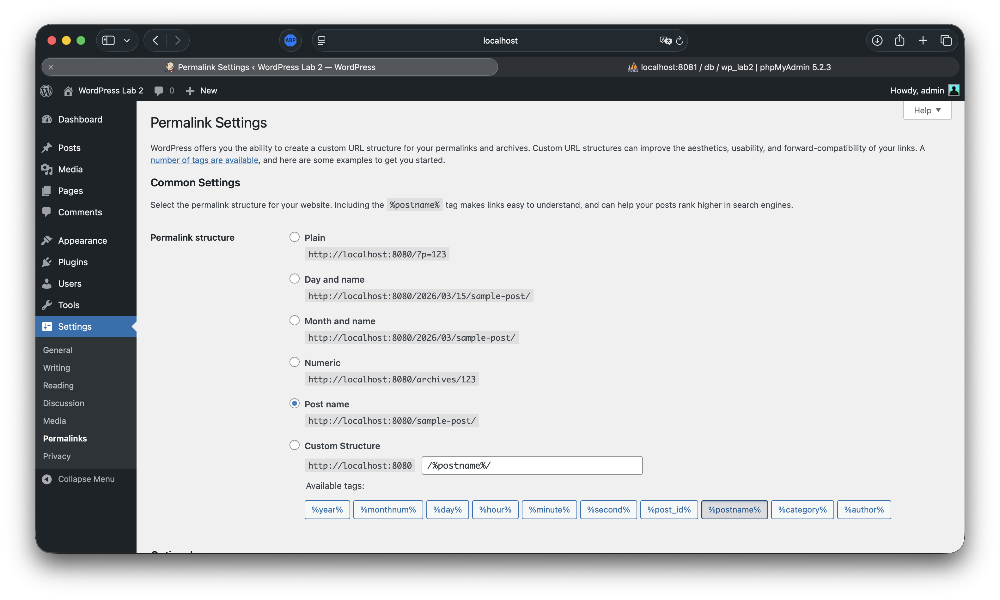
> **Скриншот 7** — Раздел Settings → Permalinks с выбранным форматом Post name.

---

### 6️⃣ Работа с темами оформления

На следующем этапе я перешёл в раздел Appearance → Themes, где изначально были доступны стандартные темы WordPress. После этого я открыл каталог официальных тем и выполнил поиск темы Astra.

Тема Astra была установлена из официального каталога WordPress и затем активирована. После активации я открыл сайт и сравнил внешний вид до и после смены темы. Было видно, что оформление сайта заметно изменилось.

> 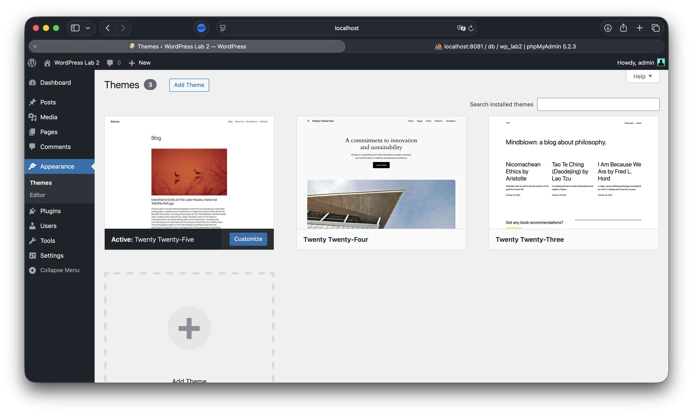
> **Скриншот 8** — Страница Themes со стандартными темами WordPress до установки Astra.

> 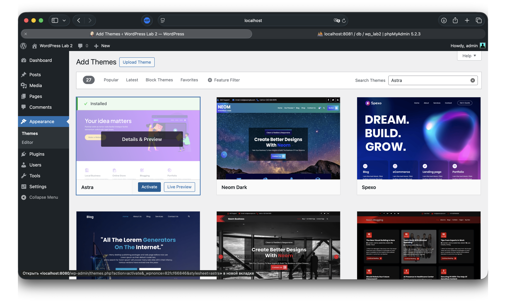
> **Скриншот 9** — Найденная тема Astra в официальном каталоге WordPress.

> 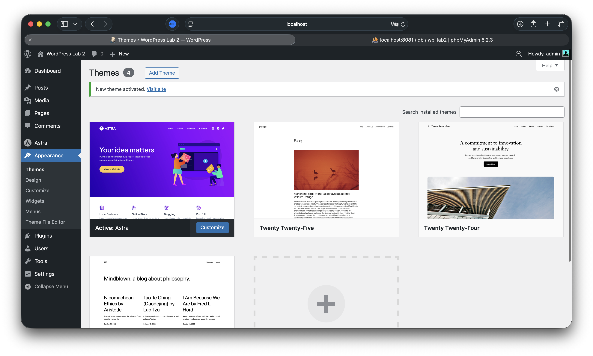
> **Скриншот 10** — Активированная тема Astra в списке тем.

> 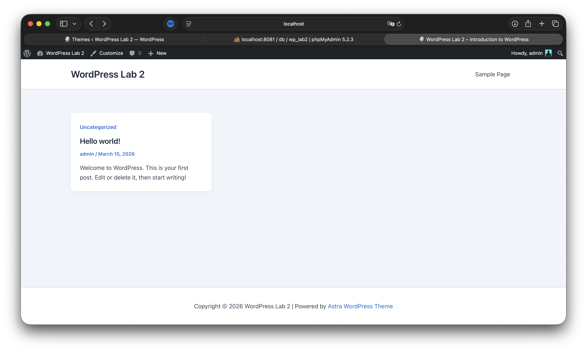
> **Скриншот 11** — Внешний вид сайта после активации темы Astra.

---

### 7️⃣ Настройка темы через Customize

После активации темы я открыл раздел Appearance → Customize, который позволяет изменять внешний вид сайта без редактирования кода.

В настройках темы я выполнил следующие действия:

- установил логотип сайта;
- изменил заголовок и описание;
- настроил цветовую схему сайта.

После внесения изменений я сохранил результат с помощью кнопки Publish и затем снова открыл сайт для проверки обновлённого внешнего вида.

> 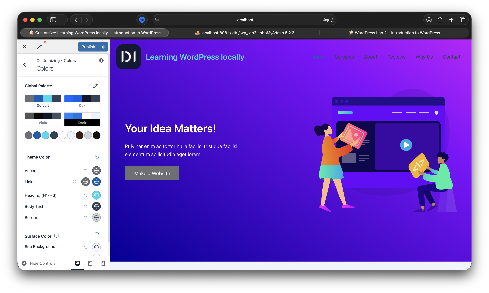
> **Скриншот 12** — Окно Customize с панелью настроек темы и предпросмотром сайта.

> 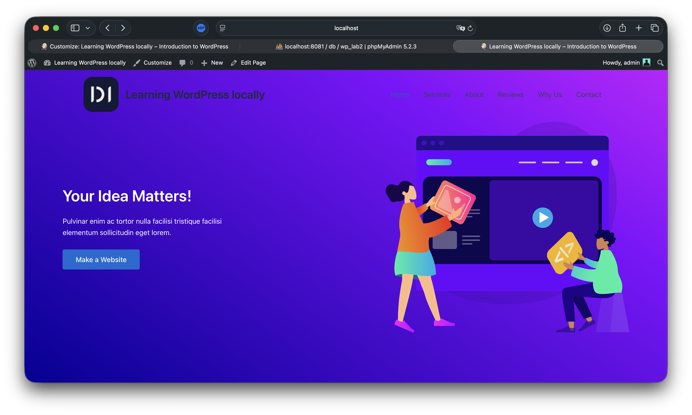
> **Скриншот 13** — Сайт после настройки логотипа, заголовка и цветовой схемы.

---

### 8️⃣ Установка и активация плагинов

После работы с темой я перешёл к расширению функциональности сайта с помощью плагинов. Для этого я открыл раздел Plugins → Add New.

Сначала я установил и активировал плагин Classic Editor, который возвращает классический редактор записей.

Затем я установил и активировал плагин Contact Form 7, который используется для создания форм обратной связи.

После установки обоих плагинов я перешёл в раздел Plugins → Installed Plugins и убедился, что оба плагина отображаются в списке как активные.

> 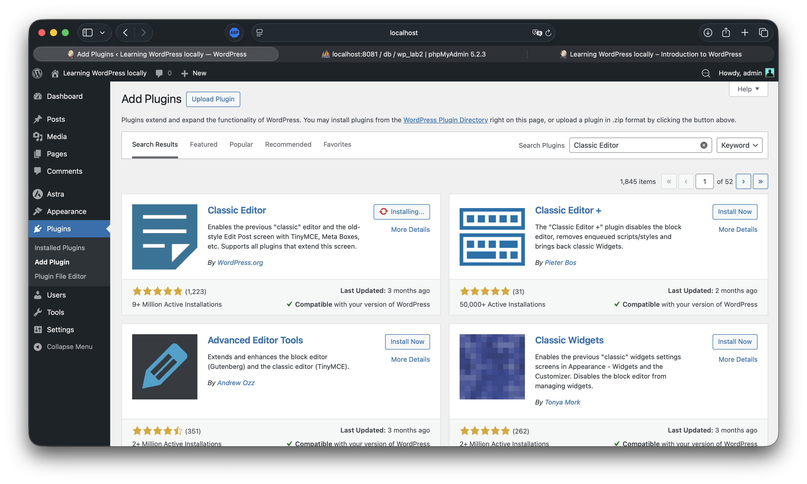
> **Скриншот 14** — Установка и активация плагина Classic Editor.

> 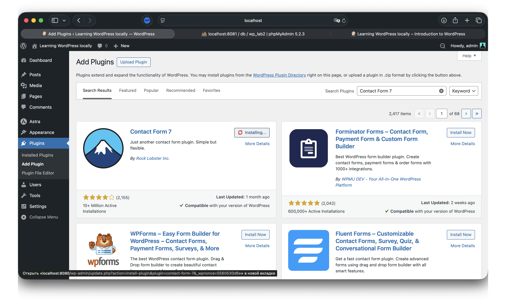
> **Скриншот 15** — Установка и активация плагина Contact Form 7.

> 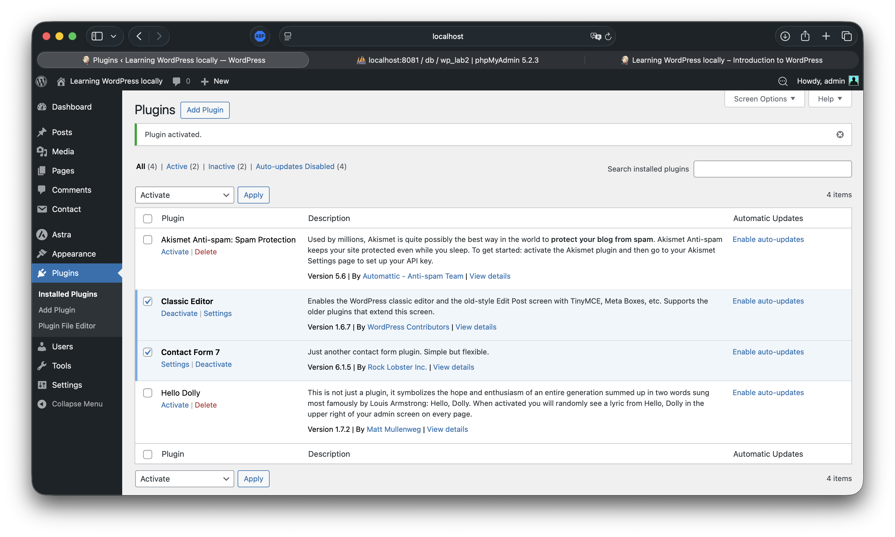
> **Скриншот 16** — Список установленных и активированных плагинов.

---

### 9️⃣ Проверка новых возможностей плагинов

После установки плагина Classic Editor я открыл раздел создания новой записи и убедился, что в системе доступен классический редактор.

После установки Contact Form 7 в административной панели появился новый раздел для управления формами. Я открыл его и просмотрел стандартную форму, созданную плагином автоматически. Также я скопировал shortcode формы для дальнейшего добавления на страницу сайта.

> 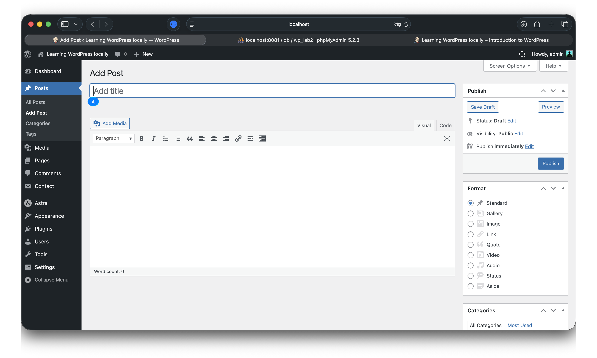
> **Скриншот 17** — Окно создания новой записи с активным Classic Editor.

> 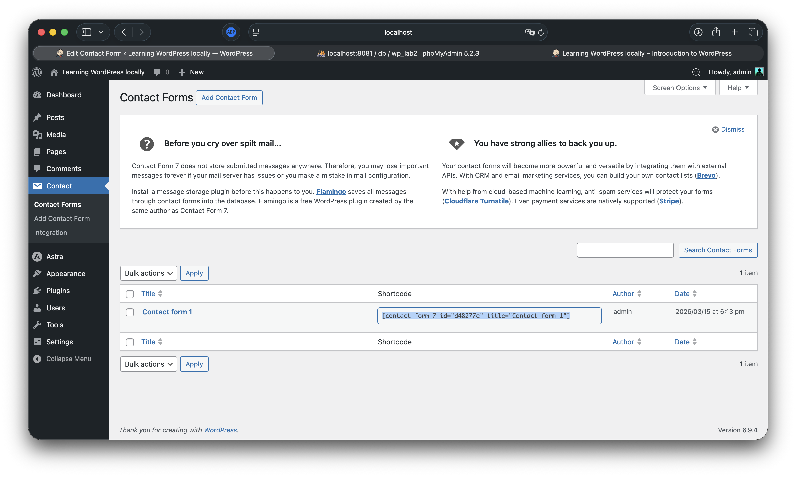
> **Скриншот 18** — Раздел Contact Form 7 со стандартной формой и shortcode.

---

### 🔟 Отключение одного из плагинов

Согласно заданию, я также проверил, как меняется функциональность сайта при отключении плагина. Для этого в разделе Plugins → Installed Plugins я временно отключил один из плагинов и убедился, что его возможности пропали из административной панели или интерфейса.

После проверки я снова включил плагин, чтобы продолжить выполнение лабораторной работы в полном объёме.

> 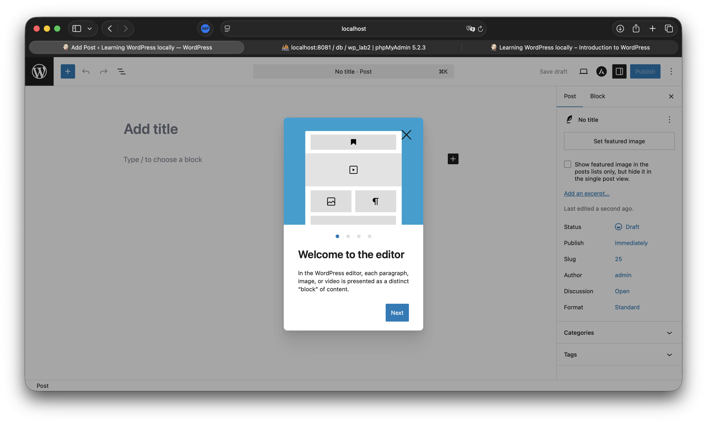
> **Скриншот 19** — Отключение одного из плагинов и изменение функциональности WordPress.

---

### 1️⃣1️⃣ Создание страницы «Контакты»

Далее я приступил к созданию контента сайта. В разделе Pages → Add New я создал новую страницу с названием «Контакты».

На эту страницу я вставил shortcode формы обратной связи, созданной с помощью плагина Contact Form 7, после чего опубликовал страницу.

Затем я открыл страницу на сайте и убедился, что форма отображается корректно и доступна для пользователя.

> 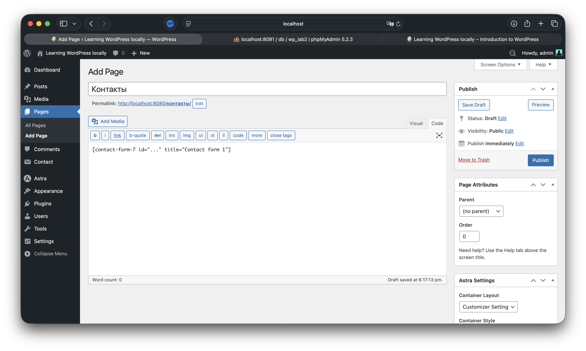
> **Скриншот 20** — Создание страницы «Контакты» с shortcode формы обратной связи.

> 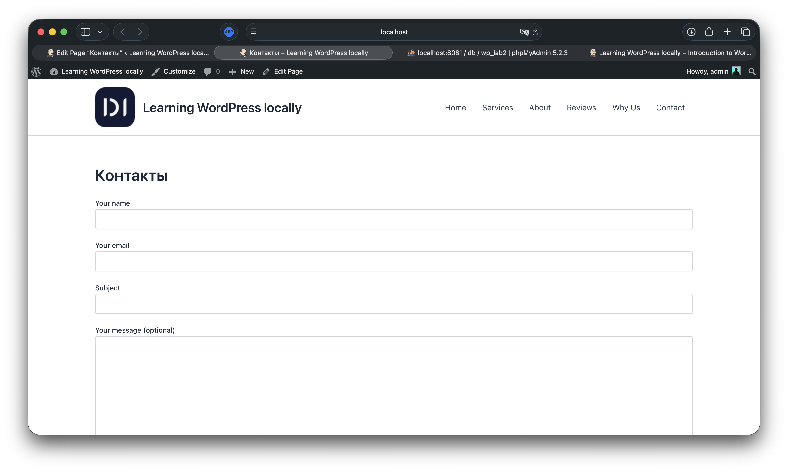
> **Скриншот 21** — Отображение страницы «Контакты» с формой на сайте.

---

### 1️⃣2️⃣ Создание записей в блоге

После этого я создал несколько записей в блоге. Для этого я использовал раздел Posts → Add New.

В рамках лабораторной работы я создал несколько тестовых записей с различным содержимым:

- записи с обычным текстом;
- записи с изображениями;
- записи с комбинированным содержимым.

Это позволило проверить базовые возможности WordPress по работе с контентом.

После публикации записей я открыл раздел Posts → All Posts, чтобы убедиться, что все материалы сохранены и доступны для просмотра.

> 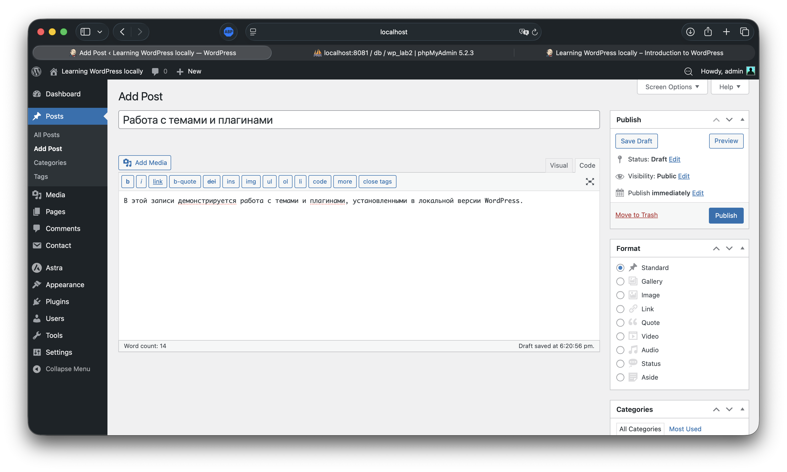
> **Скриншот 22** — Создание одной из записей в блоге в редакторе WordPress.

> 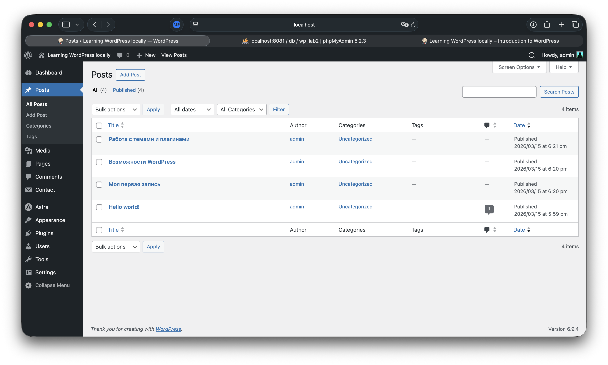
> **Скриншот 23** — Список опубликованных записей в разделе All Posts.

---

### 1️⃣3️⃣ Проверка отображения контента на сайте

На завершающем этапе практической части я открыл сайт и проверил отображение созданных записей и страницы «Контакты». Я убедился, что:

- тема применяется корректно;
- логотип и основные настройки отображаются;
- записи доступны на сайте;
- страница «Контакты» открывается;
- форма обратной связи встроена и отображается корректно.

Таким образом, сайт был полностью подготовлен в соответствии с требованиями лабораторной работы.

> 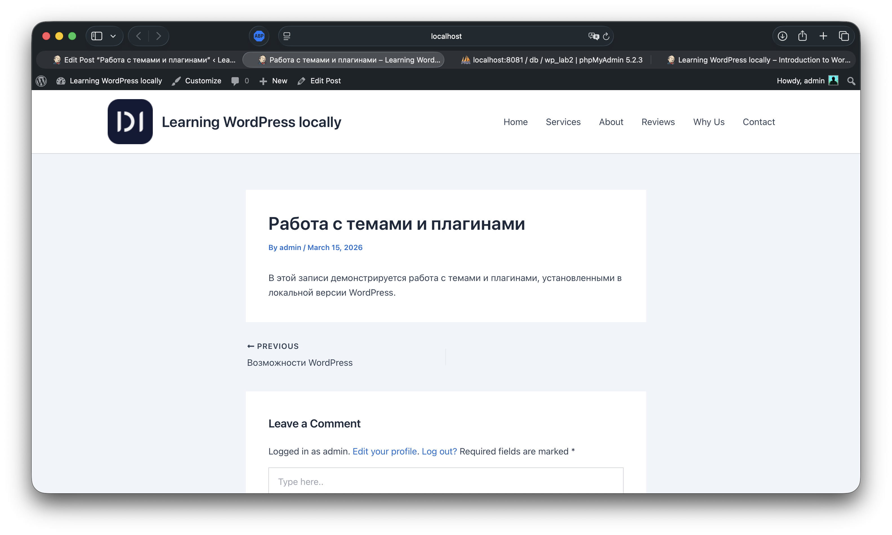
> **Скриншот 24** — Просмотр отдельной записи на сайте.

---

## ✅ Итоги выполнения практической части

**В результате выполнения лабораторной работы я:**

- развернул локальную среду для WordPress с использованием Docker;
- подготовил и проверил базу данных;
- установил WordPress и выполнил вход в административную панель;
- изменил основные настройки сайта;
- настроил формат постоянных ссылок;
- установил и активировал новую тему Astra;
- изменил внешний вид сайта через Customize;
- установил и проверил работу плагинов Classic Editor и Contact Form 7;
- создал страницу «Контакты» с формой обратной связи;
- создал несколько записей в блоге;
- проверил отображение контента на сайте.

---

## ❓ Контрольные вопросы

| №     | Вопрос                                                            | Ответ                                                                                                                                                                                                                                                                                                                                                                                                                                                                                                                                          |
| ----- | ----------------------------------------------------------------- | ---------------------------------------------------------------------------------------------------------------------------------------------------------------------------------------------------------------------------------------------------------------------------------------------------------------------------------------------------------------------------------------------------------------------------------------------------------------------------------------------------------------------------------------------- |
| **1** | **Что делает тема в WordPress, а что — плагин?**                  | Тема в WordPress отвечает за внешний вид сайта: оформление страниц, расположение блоков, стили, шрифты, цвета, шапку и подвал сайта. При смене темы меняется именно визуальное представление сайта. Плагин добавляет в WordPress новую функциональность. Например, плагины могут создавать формы обратной связи, добавлять SEO-возможности, кэширование, безопасность, новые редакторы и другие функции, которых нет в системе по умолчанию. Иначе говоря, тема отвечает в первую очередь за дизайн, а плагин — за дополнительные возможности. |
| **2** | **Почему при смене темы контент сайта не теряется?**              | Контент WordPress хранится в базе данных отдельно от темы. В базе данных сохраняются страницы, записи, комментарии, пользователи и другие данные сайта. Тема только отвечает за то, как этот контент будет отображаться на сайте. Поэтому при смене темы содержимое сайта не удаляется: меняется только способ его визуального представления.                                                                                                                                                                                                  |
| **3** | **Как можно изменить внешний вид сайта без редактирования кода?** | Изменить внешний вид сайта без редактирования кода можно несколькими способами: • установить и активировать другую тему; • использовать раздел Customize для изменения внешнего вида; • изменить логотип, заголовок, цвета и другие параметры через настройки темы; • использовать дополнительные визуальные настройки, встроенные в тему или конструктор страниц. Таким образом, WordPress позволяет вносить многие изменения во внешний вид сайта через административную панель, без ручного редактирования файлов.                          |

---

## 📊 Сводная таблица скриншотов

| №   | Что должно быть видно                                      |
| --- | ---------------------------------------------------------- |
| 1   | Запущенные Docker-контейнеры WordPress, MySQL и phpMyAdmin |
| 2   | Начальная страница установки WordPress                     |
| 3   | База данных wp_lab2 в phpMyAdmin                           |
| 4   | Форма установки WordPress с заполненными параметрами       |
| 5   | Административная панель WordPress после установки          |
| 6   | Раздел General Settings                                    |
| 7   | Раздел Permalinks с вариантом Post name                    |
| 8   | Стандартные темы WordPress                                 |
| 9   | Тема Astra в каталоге                                      |
| 10  | Активированная тема Astra                                  |
| 11  | Внешний вид сайта после активации темы                     |
| 12  | Раздел Customize                                           |
| 13  | Сайт после настройки темы                                  |
| 14  | Установка плагина Classic Editor                           |
| 15  | Установка плагина Contact Form 7                           |
| 16  | Список установленных плагинов                              |
| 17  | Окно создания записи с Classic Editor                      |
| 18  | Раздел Contact Form 7                                      |
| 19  | Отключение одного из плагинов                              |
| 20  | Страница «Контакты» в редакторе                            |
| 21  | Страница «Контакты» на сайте                               |
| 22  | Создание записи в блоге                                    |
| 23  | Список всех записей                                        |
| 24  | Просмотр отдельной записи                                  |

---

## 🎓 Вывод

В ходе выполнения лабораторной работы №2 я познакомился с базовым процессом установки и первоначальной настройки WordPress в локальной среде. Я освоил структуру административной панели, научился изменять внешний вид сайта с помощью темы, расширять его функциональность с помощью плагинов, а также создавать базовый контент в виде страниц и записей.

Практическая часть работы показала, что WordPress является удобной системой управления контентом, позволяющей быстро развернуть сайт, настроить его внешний вид и расширить функциональность без необходимости глубокого редактирования кода.

Выполненная лабораторная работа позволила мне получить первичные практические навыки работы с WordPress и лучше понять роль тем, плагинов и административной панели в структуре CMS.
