# 📚 Лабораторная работа №3

# Разработка простой темы WordPress

WordPress • Docker • PHP Templates • Custom Theme • wp-content/themes

---

📋 Студент

| Параметр              | Значение                                                     |
| --------------------- | ------------------------------------------------------------ |
| **Имя и фамилия**     | Савка Никита (Savca Nichita)                                 |
| **Группа**            | I2302                                                        |
| **Рабочая станция**   | macOS (MacBook Air, Apple Silicon M3)                        |
| **Среда выполнения**  | Docker Desktop, Docker Compose, WordPress, MySQL, phpMyAdmin |
| **Формат выполнения** | Разработка собственной темы в уже существующей установке WP  |
| **Дата выполнения**   | 22 марта 2026                                                |

---

## 🎯 Цель и задачи работы

Целью данной лабораторной работы было научиться создавать собственную тему WordPress, разобраться в её минимальной структуре и понять принципы работы шаблонов в системе WordPress.

**В рамках выполнения работы требовалось:**

- Перейти в папку тем WordPress и создать собственную директорию темы
- Включить режим отладки в WordPress (`WP_DEBUG`)
- Создать обязательные файлы темы (`style.css` и `index.php`)
- Реализовать основные шаблоны и вынести общие части сайта в отдельные файлы
- Подключить стили темы через `functions.php`
- Создать дополнительные шаблоны для записей, страниц, архива, боковой панели и комментариев
- Стилизовать тему
- Добавить превью темы `screenshot.png`
- Активировать тему в административной панели WordPress и проверить её работу

---

## 📝 Краткое описание выполненной работы

В ходе выполнения лабораторной работы я использовал уже существующую локальную установку WordPress, развёрнутую в Docker в предыдущей лабораторной работе. Это позволило мне не создавать новую среду с нуля, а сразу перейти к разработке темы внутри уже настроенного WordPress-сайта.

Я создал собственную тему usm-theme в директории wp-content/themes, включил режим отладки WP_DEBUG, добавил обязательные файлы style.css и index.php, после чего реализовал остальные шаблоны: header.php, footer.php, sidebar.php, single.php, page.php, comments.php, archive.php и functions.php. Далее я оформил тему базовыми стилями, добавил файл-превью screenshot.png, активировал тему в админ-панели WordPress и проверил отображение сайта на главной странице, на странице отдельной записи, на обычной странице и в архиве записей.

---

## 🛠️ Используемые технологии и инструменты

**В процессе выполнения были использованы:**

- **macOS** на MacBook Air M3
- **Docker Desktop** для использования подготовленной локальной среды
- **Docker Compose** для запуска WordPress-контейнеров
- **WordPress** как CMS и платформа для разработки темы
- **PHP** для шаблонов темы
- **HTML** для структуры шаблонов
- **CSS** для стилизации темы
- **CLI / Terminal** для работы с файлами внутри контейнера
- **Git** для подготовки темы к загрузке в репозиторий

---

## 🧠 Общая идея реализации

В данной лабораторной работе я не использовал готовую тему как основу, а создал собственную минимальную тему WordPress вручную. За основу была взята уже существующая локальная установка WordPress из предыдущей лабораторной работы, в которой уже были созданы тестовые записи и страница «Контакты». Это позволило сразу проверять работу шаблонов на реальном контенте.

Разработка велась внутри папки wp-content/themes/usm-theme. Я последовательно создавал файлы темы и наполнял их минимальным, но рабочим содержимым. В результате была получена простая пользовательская тема, поддерживающая:

- главную страницу со списком записей;
- отдельные записи;
- отдельные страницы;
- архивы;
- боковую панель;
- комментарии;
- собственные стили.

---

## 📂 Структура созданной темы

В результате выполнения лабораторной работы была создана следующая структура темы:

```
usm-theme/
├── style.css
├── index.php
├── header.php
├── footer.php
├── functions.php
├── single.php
├── page.php
├── sidebar.php
├── comments.php
├── archive.php
└── screenshot.png
```

> 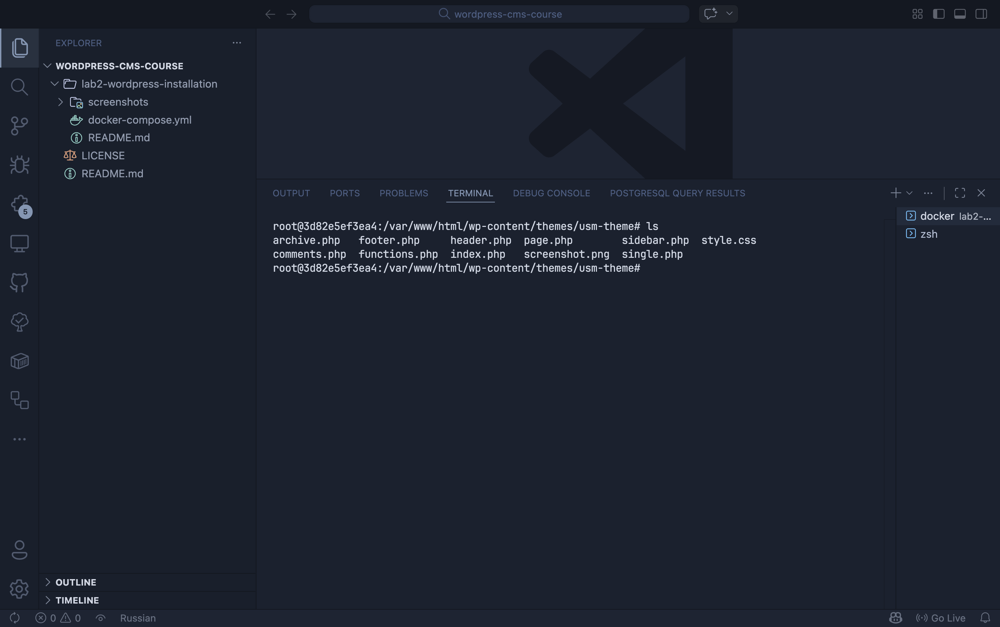
> **Скриншот 1** — Структура файлов пользовательской темы usm-theme в папке wp-content/themes.
>
> ---

## 🔧 Ход выполнения лабораторной работы

### 1️⃣ Подготовка среды и повторное использование локального WordPress

Для выполнения лабораторной работы я использовал уже существующую локальную установку WordPress, созданную ранее в Docker. Я запустил подготовленные контейнеры WordPress, MySQL и phpMyAdmin и убедился, что сайт и административная панель открываются корректно.

Такой подход позволил мне не выполнять повторную установку WordPress, а сразу перейти к разработке темы и её проверке на уже существующем сайте с готовым контентом.

> 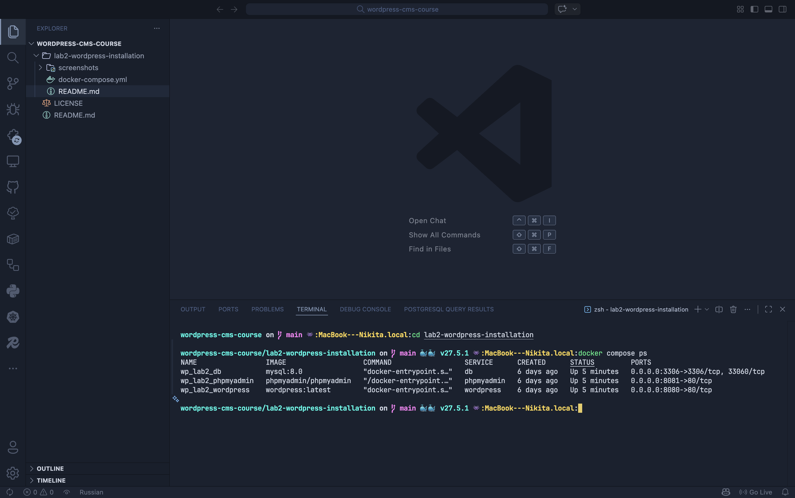
> **Скриншот 2** — Запущенные контейнеры WordPress, MySQL и phpMyAdmin в терминале.
>
> ---

### 2️⃣ Переход в директорию тем WordPress

После запуска среды я подключился к контейнеру WordPress через терминал и перешёл в директорию wp-content/themes, где хранятся все темы WordPress.

В этой директории уже находились стандартные и ранее установленные темы. Внутри неё я создал новую папку usm-theme, которая стала основой моей собственной пользовательской темы.

> 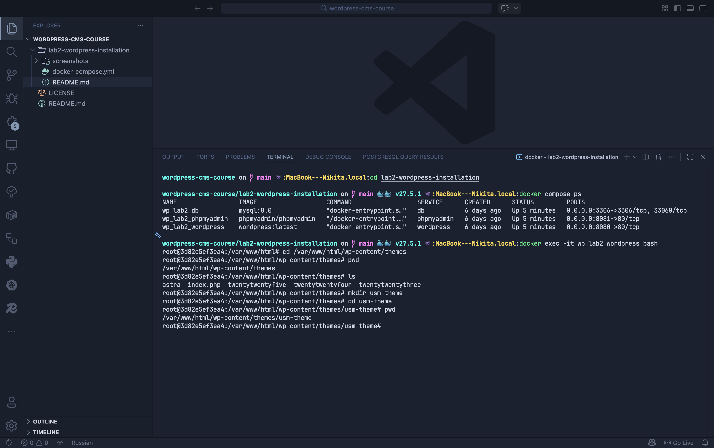
> **Скриншот 3** — Папка wp-content/themes и созданная директория темы usm-theme.
>
> ---

### 3️⃣ Включение режима отладки WordPress

Следующим этапом я открыл файл wp-config.php и включил режим отладки, установив значение:

define('WP_DEBUG', true);

Включение режима отладки необходимо для разработки темы, так как оно помогает выявлять возможные предупреждения, ошибки и неточности в шаблонах во время работы с WordPress.

> 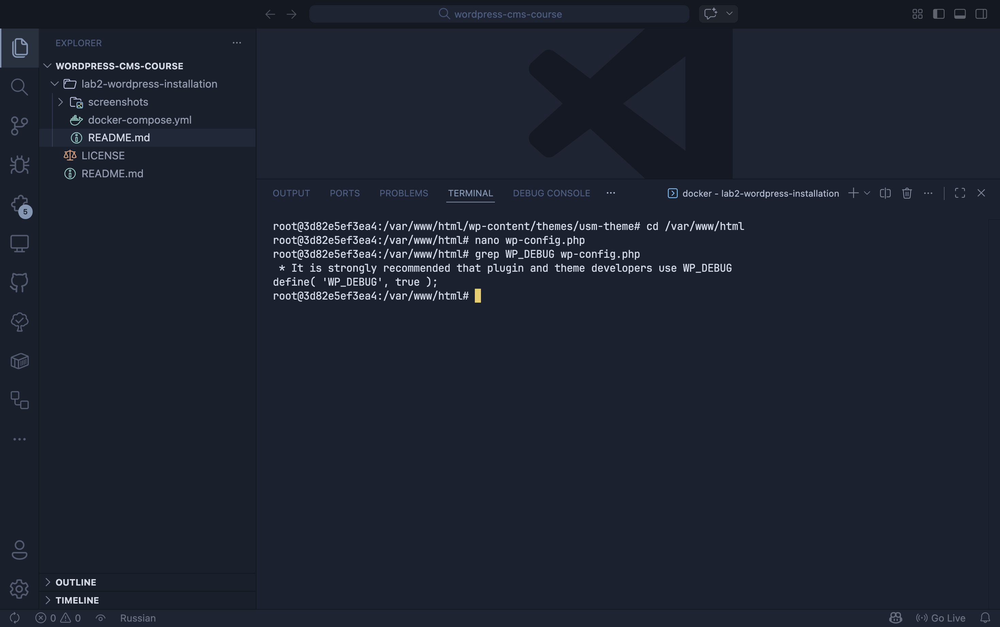
> **Скриншот 4** — Включённый параметр WP_DEBUG в файле wp-config.php.
>
> ---

### 4️⃣ Создание обязательных файлов темы

В папке usm-theme я создал обязательные файлы любой темы WordPress:

- style.css
- index.php

Файл style.css содержит метаданные темы, по которым WordPress распознаёт её в административной панели. Кроме того, в этот файл были добавлены базовые CSS-стили.

Файл index.php является главным шаблоном темы и выступает базовым шаблоном для отображения контента.

> 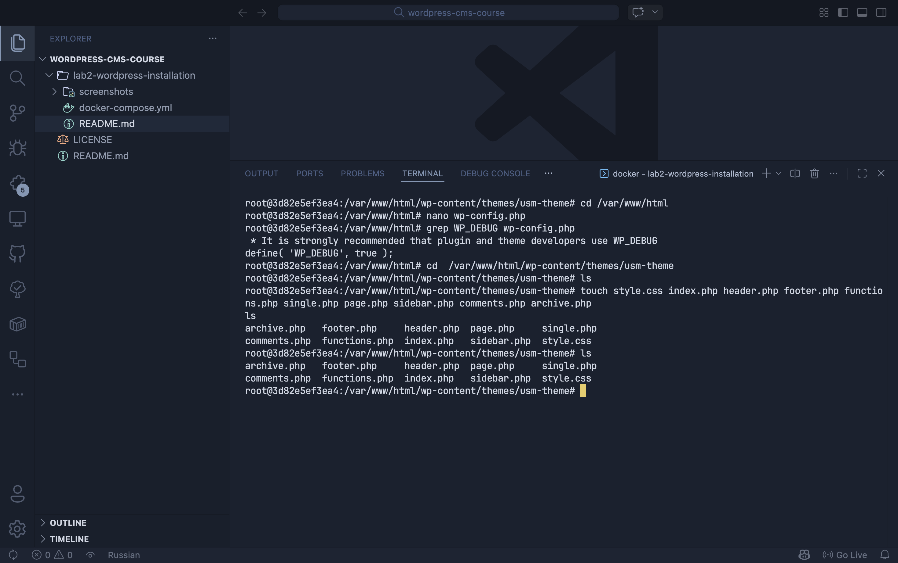
> **Скриншот 5** — Созданные обязательные файлы style.css и index.php в папке темы.
>
> ---

### 5️⃣ Файл style.css и метаданные темы

После создания style.css я добавил в него метаданные темы, включая название, автора, описание и версию. После блока метаданных я описал базовые CSS-правила для основных элементов сайта:

- body;
- шапки сайта;
- основного контента;
- боковой панели;
- карточек записей;
- подвала сайта;
- области комментариев.

Таким образом, style.css стал не только техническим файлом для распознавания темы, но и основным файлом стилизации пользовательского интерфейса.

> 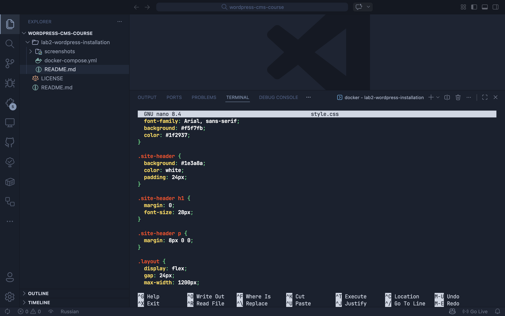
> **Скриншот 6** — Содержимое файла style.css с метаданными темы и базовыми стилями.
>
> ---

### 6️⃣ Выделение общих частей шаблона

Следующим этапом я вынес общие части сайта в отдельные шаблонные файлы:

- header.php — шапка сайта;
- footer.php — подвал сайта;
- sidebar.php — боковая панель.

В header.php я разместил начальную HTML-структуру страницы, подключение wp_head(), название сайта, описание и открытие основной области макета.

В footer.php я разместил закрытие основной части страницы, подвал сайта и вызов wp_footer().

В sidebar.php я реализовал простую боковую панель с текстом и ссылками навигации.

После этого в основном шаблоне я подключил эти файлы с помощью встроенных функций WordPress:

- get_header()
- get_footer()
- get_sidebar()

> 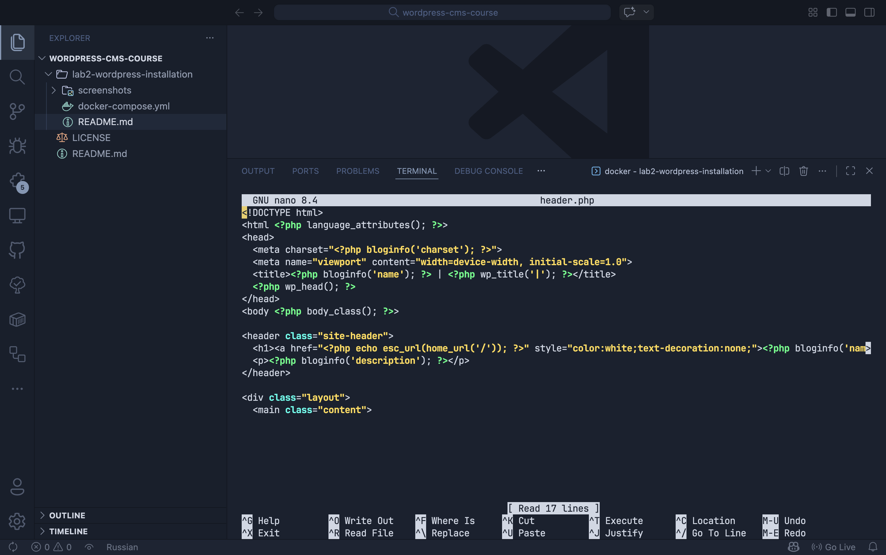
> **Скриншот 7** — Файл header.php с кодом шапки сайта.
> 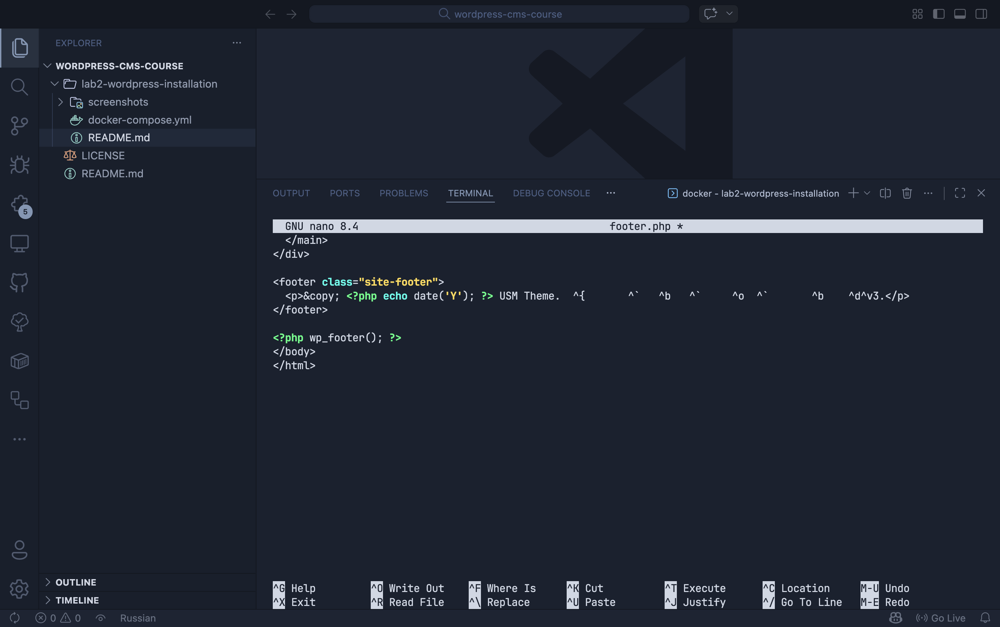
> **Скриншот 8** — Файл footer.php с кодом подвала сайта.
> 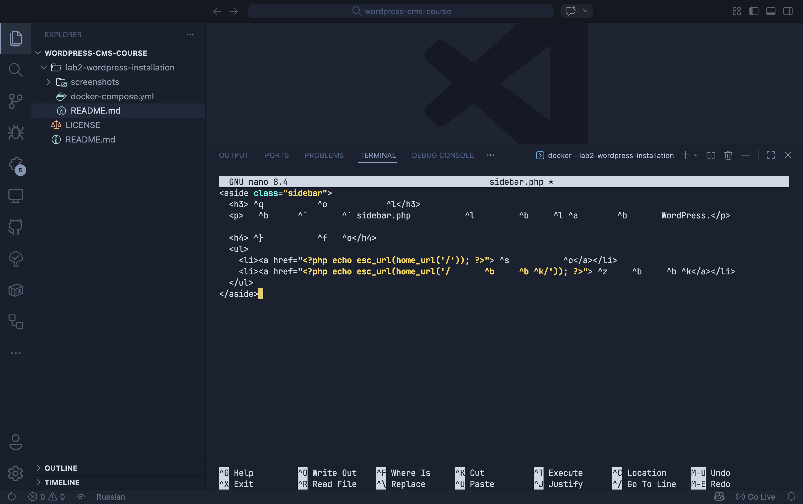
> **Скриншот 9** — Файл sidebar.php с боковой панелью.
>
> ---

### 7️⃣ Реализация главного шаблона index.php

В файле index.php я реализовал главный шаблон темы. В нём были подключены общие части шаблона, а также реализован вывод последних 5 записей с помощью цикла WordPress.

Для этого я использовал WP_Query с ограничением количества записей до пяти. Для каждой записи на главной странице отображались:

- заголовок;
- ссылка на полную запись;
- дата публикации;
- краткое описание (excerpt).

Таким образом, главная страница пользовательской темы стала выводить список последних записей сайта в оформленном виде.

> 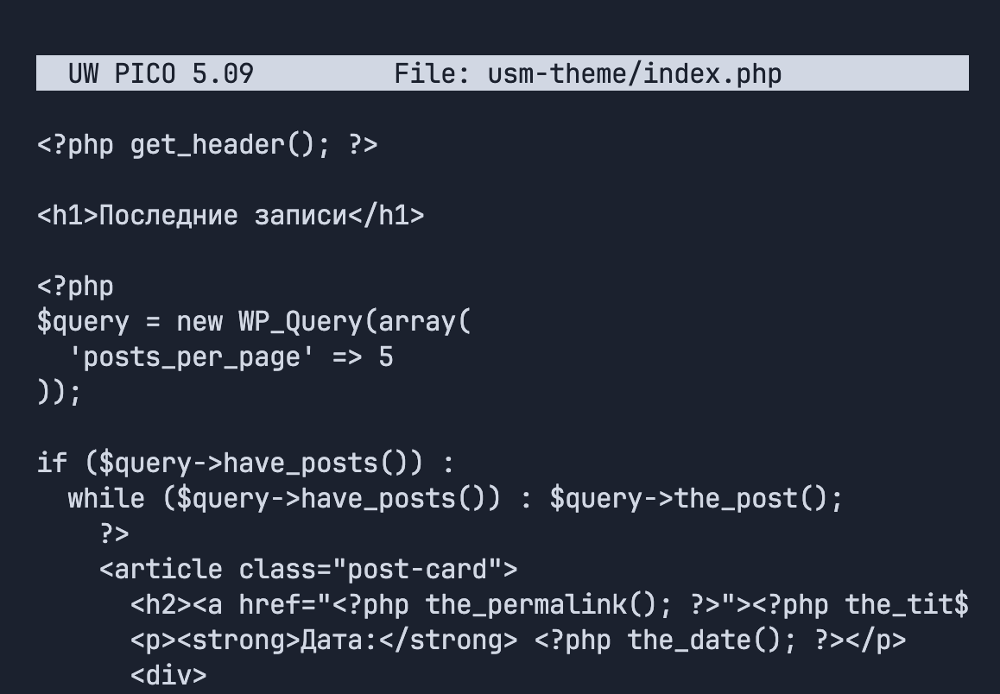
> **Скриншот 10** — Файл index.php с подключением шаблонных частей и циклом WordPress.
>
> ---

### 8️⃣ Создание файла functions.php

После этого я создал файл functions.php. В нём была реализована функция подключения стилей темы через механизм WordPress wp_enqueue_style().

Использование functions.php важно, так как именно через этот файл в теме обычно подключаются:

- CSS-файлы;
- JavaScript-файлы;
- дополнительные функции темы;
- поддержка различных возможностей WordPress.

В данной лабораторной работе через functions.php я подключил основной файл стилей style.css.

> 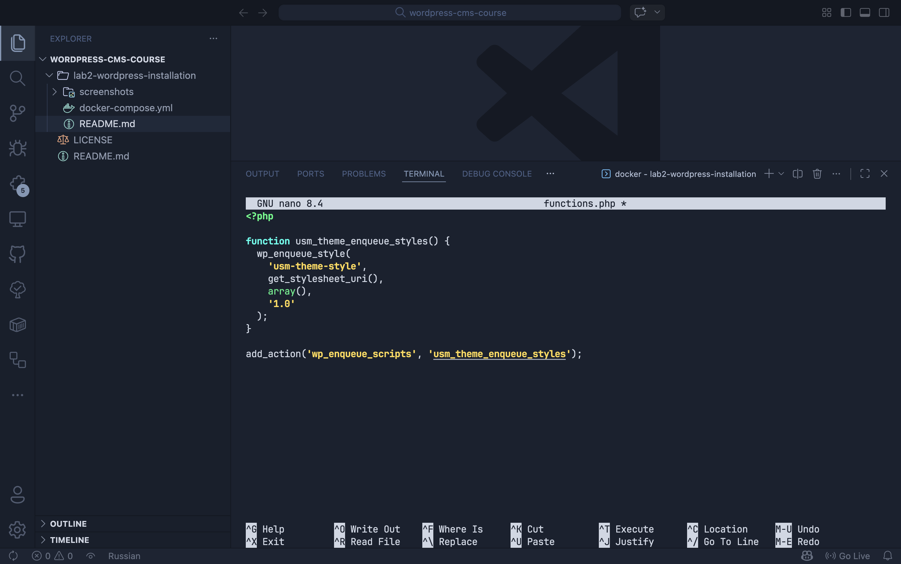
> **Скриншот 11** — Файл functions.php с подключением стилей темы.
>
> ---

### 9️⃣ Создание шаблона single.php

Далее я создал файл single.php, который отвечает за отображение отдельной записи WordPress.

В этом шаблоне я реализовал:

- подключение header.php;
- вывод заголовка записи;
- вывод даты;
- отображение полного содержимого записи;
- подключение блока комментариев через comments_template();
- подключение боковой панели и подвала.

Этот шаблон использовался при открытии отдельных записей блога.

> 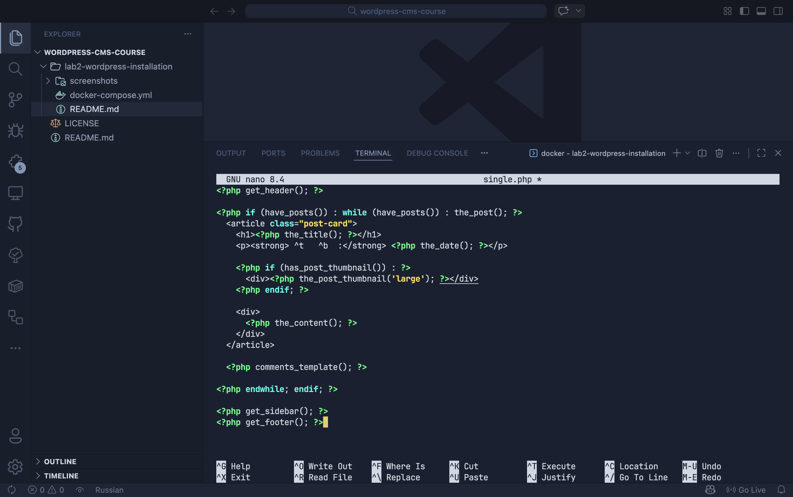
> **Скриншот 12** — Файл single.php для отображения отдельной записи.
>
> ---

### 🔟 Создание шаблона page.php

Следующим шагом был создан файл page.php, предназначенный для отображения обычных страниц WordPress.

В нём я реализовал вывод:

- заголовка страницы;
- основного содержимого страницы;
- комментариев;
- боковой панели;
- подвала сайта.

Этот шаблон использовался, например, для страницы «Контакты», созданной в предыдущей лабораторной работе.

> 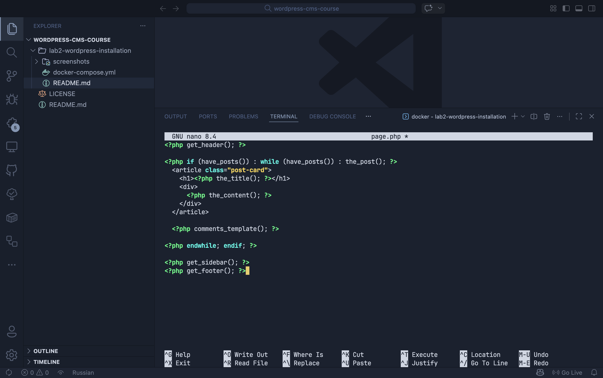
> **Скриншот 13** — Файл page.php для отображения обычных страниц.
>
> ---

### 1️⃣1️⃣ Создание шаблона comments.php

После этого я создал файл comments.php, который отвечает за отображение комментариев в теме.

В данном файле я реализовал:

- заголовок секции комментариев;
- вывод списка комментариев, если они существуют;
- вывод текста об отсутствии комментариев, если комментариев ещё нет;
- стандартную форму добавления комментария через comment_form().

Этот шаблон был подключён в single.php и page.php.

> 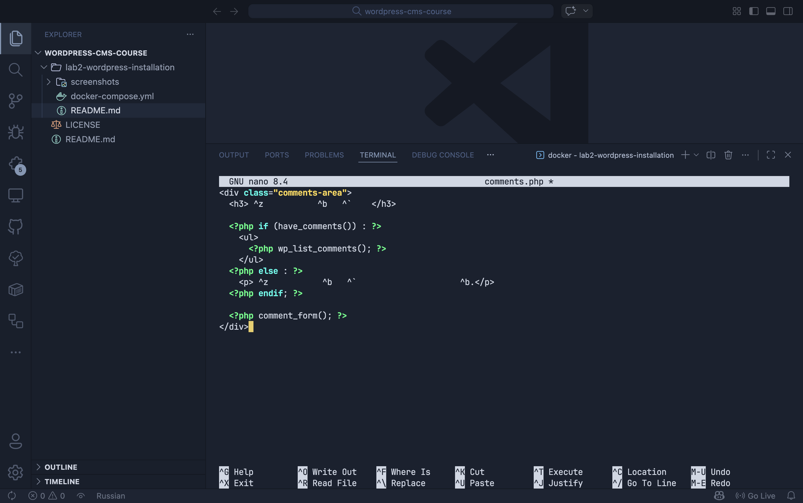
> **Скриншот 14** — Файл comments.php с блоком комментариев и формой.
>
> ---

### 1️⃣2️⃣ Создание шаблона archive.php

Также я создал файл archive.php, предназначенный для отображения архивов записей WordPress.

В этом шаблоне был реализован вывод списка записей архива с кратким содержимым. Он использовался для проверки архивных страниц сайта, например архивов по дате или другим параметрам WordPress.

> 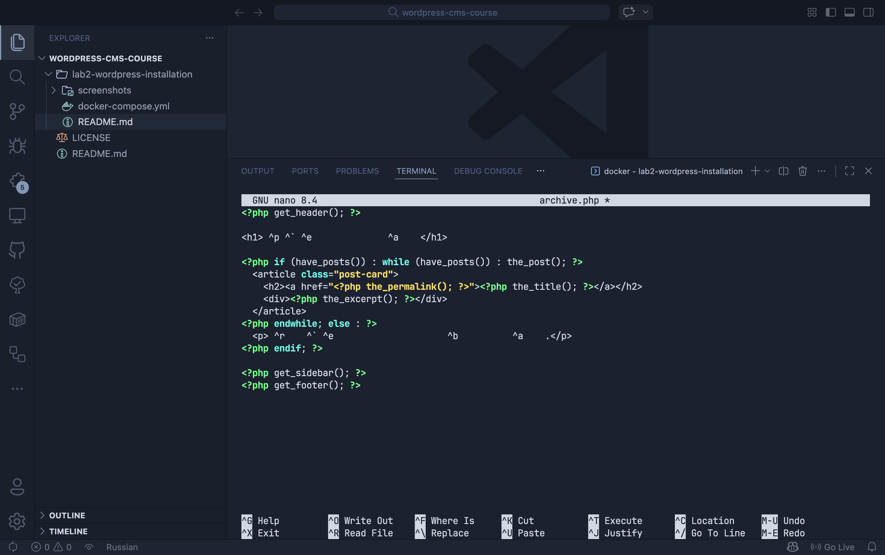
> **Скриншот 15** — Файл archive.php для отображения архивов записей.
>
> ---

### 1️⃣3️⃣ Стилизация темы

После реализации структуры шаблонов я завершил оформление темы с помощью CSS в файле style.css.

Я добавил стили для следующих элементов:

- шапки сайта;
- подвала;
- основной области контента;
- боковой панели;
- карточек записей;
- ссылок;
- области комментариев.

Цель стилизации состояла не в создании сложного дизайна, а в том, чтобы пользовательская тема выглядела аккуратно, читабельно и визуально отличалась от стандартных тем WordPress.

> 
> **Скриншот 16** — Применённые стили пользовательской темы после обновления сайта.
>
> ---

### 1️⃣4️⃣ Добавление screenshot.png

Согласно заданию, в папку темы необходимо было добавить файл screenshot.png размером 1200x900 пикселей. Этот файл используется WordPress как превью темы в разделе Appearance → Themes.

Я подготовил изображение-превью и поместил его в корень папки usm-theme. После этого WordPress начал отображать превью темы в административной панели.

> 
> **Скриншот 17** — Файл screenshot.png, добавленный в папку темы.
>
> ---

### 1️⃣5️⃣ Активация пользовательской темы

После завершения разработки файлов темы я открыл административную панель WordPress и перешёл в раздел Appearance → Themes.

В списке тем появилась созданная мной тема USM Theme с названием, описанием и превью. Я активировал её и сделал её основной темой сайта.

После активации я убедился, что сайт начал отображаться уже через шаблоны моей собственной темы.

> 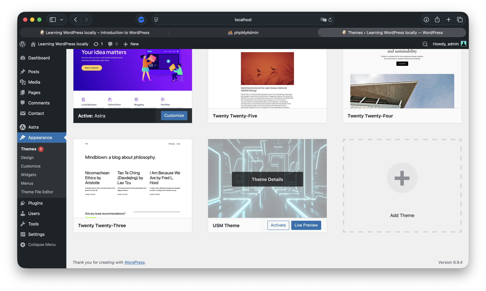
> **Скриншот 18** — Тема USM Theme в разделе Appearance → Themes.
> 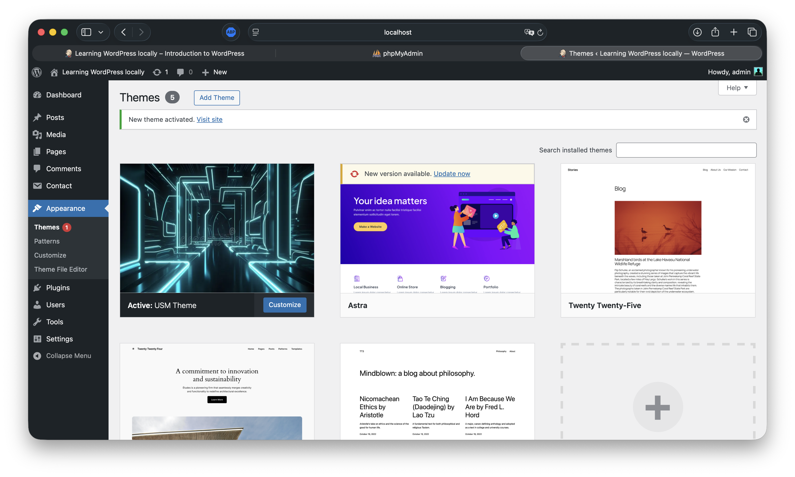
> **Скриншот 19** — Активированная пользовательская тема USM Theme.
>
> ---

### 1️⃣6️⃣ Проверка работы темы на сайте

После активации я последовательно проверил работу основных шаблонов:

#### Главная страница

На главной странице сайта отображались последние записи, выведенные через `index.php`, а также боковая панель и подвал.

> 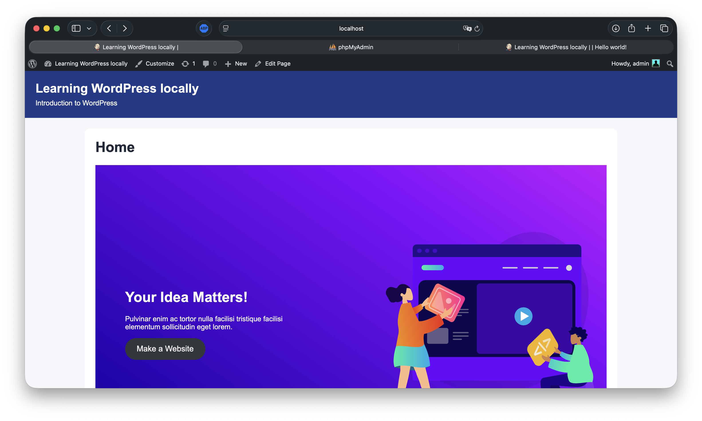
> **Скриншот 20** — Главная страница сайта после активации пользовательской темы.

#### Отдельная запись

Я открыл одну из записей блога и убедился, что она отображается через `single.php`, включая содержимое записи, панель и комментарии.

> 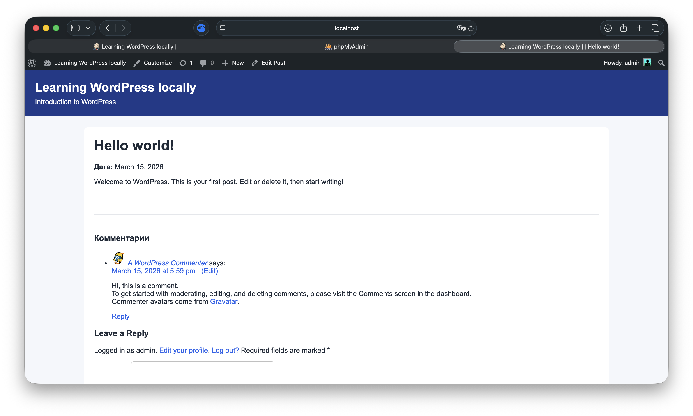
> **Скриншот 21** — Отдельная запись, отображаемая через шаблон single.php.

#### Обычная страница

Я открыл страницу «Контакты» и проверил, что она отображается через `page.php` и содержит форму обратной связи, добавленную ранее.

> 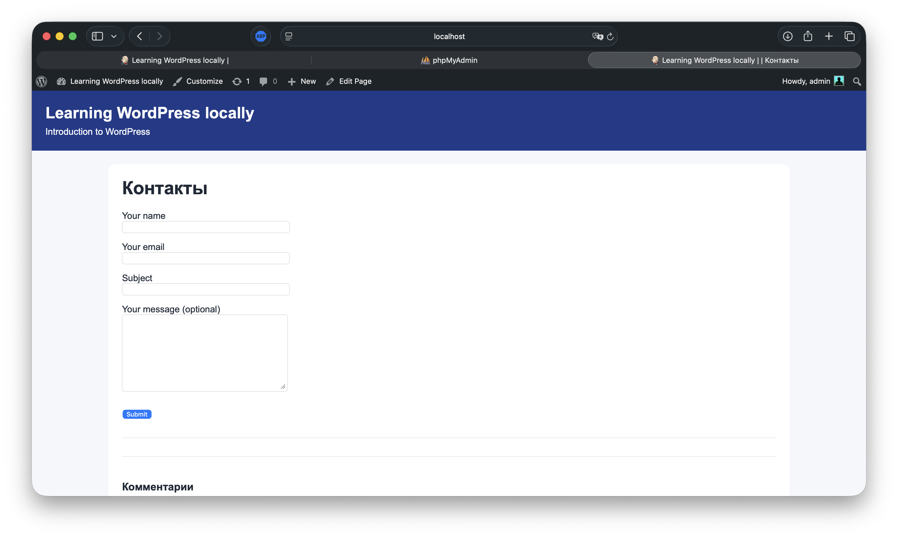
> **Скриншот 22** — Страница «Контакты», отображаемая через шаблон page.php.

#### Архив записей

Я также открыл архивную страницу сайта и убедился, что она обрабатывается через шаблон `archive.php`.

> 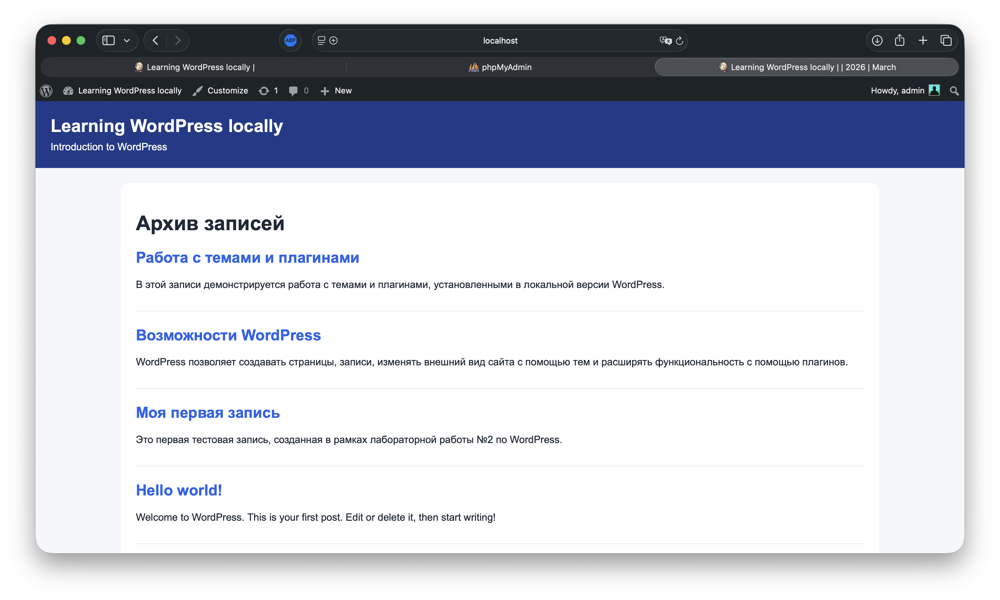
> **Скриншот 23** — Архив записей, отображаемый через шаблон archive.php.

#### Комментарии

Отдельно я проверил отображение блока комментариев и формы комментариев, подключённых через `comments.php`.

> 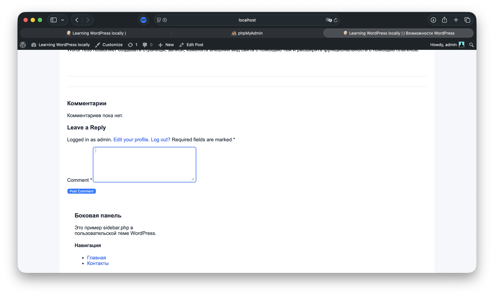
> **Скриншот 24** — Блок комментариев, подключённый через comments.php.
>
> ---

### 1️⃣7️⃣ Подготовка темы к загрузке в Git

Последним практическим шагом я скопировал папку темы из контейнера Docker на локальную файловую систему macOS и подготовил её к загрузке в Git-репозиторий. Это необходимо, так как по заданию тема лабораторной работы должна быть загружена в систему контроля версий.

После этого тема могла быть помещена в GitHub, GitLab или другой поддерживаемый Git-репозиторий.

## ✅ Итоги выполнения практической части

**В результате выполнения лабораторной работы я:**

- Использовал существующую локальную установку WordPress в Docker
- Создал собственную тему `usm-theme` в папке `wp-content/themes`
- Включил режим отладки `WP_DEBUG`
- Реализовал обязательные файлы темы `style.css` и `index.php`
- Вынес общие части шаблона в `header.php`, `footer.php` и `sidebar.php`
- Подключил стили через `functions.php`
- Создал дополнительные шаблоны `single.php`, `page.php`, `comments.php` и `archive.php`
- Реализовал вывод последних 5 записей на главной странице
- Добавил стили для основных частей сайта
- Добавил превью темы `screenshot.png`
- Активировал тему в административной панели
- Проверил её работу на разных типах страниц
- Подготовил тему к загрузке в Git

---

## 📘 Краткая документация к теме

### Название и назначение

**Название:** USM Theme

**Назначение:** Тема предназначена для учебной лабораторной работы и демонстрирует минимальную структуру пользовательской темы WordPress.

### Реализованные шаблоны

- `index.php` — главная страница и fallback-шаблон
- `single.php` — отдельная запись
- `page.php` — отдельная страница
- `archive.php` — архив записей
- `header.php` — шапка сайта
- `footer.php` — подвал сайта
- `sidebar.php` — боковая панель
- `comments.php` — комментарии
- `functions.php` — подключение стилей

### Особенности реализации

- Стили темы подключаются через `wp_enqueue_style()`
- Общие части шаблона подключаются через стандартные функции WordPress
- На главной странице выводятся 5 последних записей
- В теме присутствует собственное превью `screenshot.png`

---

## 🚀 Инструкции по запуску проекта

Если WordPress уже развёрнут в Docker, для запуска проекта:

1. Запустить Docker-контейнеры WordPress, MySQL и phpMyAdmin
2. Убедиться, что WordPress доступен по локальному адресу
3. Поместить папку `usm-theme` в директорию `wp-content/themes/`
4. Перейти в административную панель WordPress
5. Открыть раздел **Appearance → Themes**
6. Найти тему **USM Theme** и активировать её

---

## ❓ Контрольные вопросы

| №   | Вопрос                                           | Ответ                                                                                                                                                                                       |
| --- | ------------------------------------------------ | ------------------------------------------------------------------------------------------------------------------------------------------------------------------------------------------- |
| 1   | Какие два файла обязательны для темы WordPress?  | Для любой темы WordPress обязательны два файла: `style.css` и `index.php`. Файл `style.css` содержит метаданные темы и стили, а `index.php` является главным шаблоном темы.                 |
| 2   | Как подключаются общие части шаблонов?           | Общие части подключаются стандартными функциями WordPress: `get_header()`, `get_footer()` и `get_sidebar()`. Это позволяет переиспользовать части шаблона в разных файлах.                  |
| 3   | Чем отличаются index.php, single.php и page.php? | `index.php` — основной шаблон и fallback. `single.php` — отдельная запись блога. `page.php` — отдельные страницы сайта.                                                                     |
| 4   | Зачем нужен файл functions.php в теме?           | `functions.php` добавляет функциональность темы: подключение стилей/скриптов, регистрация меню, виджеты, поддержка миниатюр. В данной работе использован для подключения файла стилей темы. |

---

## 📷 Сводная таблица скриншотов

| №   | Что должно быть видно                                     |
| --- | --------------------------------------------------------- |
| 1   | Структура файлов пользовательской темы usm-theme          |
| 2   | Запущенные Docker-контейнеры WordPress, MySQL, phpMyAdmin |
| 3   | Папка wp-content/themes и директория usm-theme            |
| 4   | Параметр WP_DEBUG в wp-config.php                         |
| 5   | Созданные обязательные файлы темы                         |
| 6   | Содержимое style.css                                      |
| 7   | Содержимое header.php                                     |
| 8   | Содержимое footer.php                                     |
| 9   | Содержимое sidebar.php                                    |
| 10  | Содержимое index.php                                      |
| 11  | Содержимое functions.php                                  |
| 12  | Содержимое single.php                                     |
| 13  | Содержимое page.php                                       |
| 14  | Содержимое comments.php                                   |
| 15  | Содержимое archive.php                                    |
| 16  | Результат стилизации темы на сайте                        |
| 17  | Файл screenshot.png в папке темы                          |
| 18  | Тема USM Theme в списке тем WordPress                     |
| 19  | Активированная тема USM Theme                             |
| 20  | Главная страница с пользовательской темой                 |
| 21  | Отдельная запись через single.php                         |
| 22  | Страница «Контакты» через page.php                        |
| 23  | Архив записей через archive.php                           |
| 24  | Блок комментариев через comments.php                      |

---

## 📚 Список использованных источников

1. WordPress.org — Theme Developer Handbook
2. WordPress.org — Template Files
3. WordPress.org — Functions Reference (get_header, get_footer, get_sidebar)
4. WordPress.org — Plugin API / wp_enqueue_style
5. WordPress.org — Creating Themes

---

## 🎓 Вывод

В ходе выполнения лабораторной работы №3 я разработал собственную простую тему WordPress и на практике изучил минимальную структуру темы и основные принципы работы шаблонов в WordPress.

Я научился создавать обязательные файлы темы, выносить общие части шаблона в отдельные файлы, подключать стили через functions.php, использовать шаблоны для записей, страниц, архивов и комментариев, а также активировать собственную тему в административной панели WordPress.

Практическая часть показала, что даже простая тема WordPress строится на чёткой системе шаблонов и функций, а сама CMS предоставляет удобный механизм для разделения структуры сайта на повторно используемые части.

Выполнение данной лабораторной работы позволило мне лучше понять внутреннее устройство тем WordPress и закрепить базовые навыки пользовательской разработки в WordPress.
