# Лабораторная работа №4

## Разработка плагина для WordPress

WordPress • Docker • Custom Plugin • Custom Post Type • Taxonomy • Meta Box • Shortcode

---

## 📋 Студент

| Параметр          | Значение                                                                                   |
| ----------------- | ------------------------------------------------------------------------------------------ |
| Имя и фамилия     | Савка Никита (Savca Nichita)                                                               |
| Группа            | I2302                                                                                      |
| Рабочая станция   | macOS (MacBook Air, Apple Silicon M3)                                                      |
| Среда выполнения  | Docker Desktop, Docker Compose, WordPress, MySQL, phpMyAdmin, браузер, CLI                 |
| Формат выполнения | Разработка собственного WordPress-плагина в уже существующей локальной установке WordPress |
| Дата выполнения   | 28.03.2026                                                                                 |

---

## 🎯 Цель и задачи работы

Целью данной лабораторной работы было освоить расширяемую модель данных WordPress и на практике реализовать собственный учебный плагин, включающий:

- Custom Post Type (CPT);
- пользовательскую таксономию;
- метаполе с метабоксом в административной панели;
- валидацию и безопасное сохранение данных;
- шорткод для отображения данных на сайте.

В рамках выполнения лабораторной работы требовалось:

- создать собственный WordPress-плагин;
- зарегистрировать тип записей «Заметки»;
- зарегистрировать пользовательскую таксономию «Приоритет»;
- добавить метабокс для даты напоминания;
- реализовать проверку nonce и базовую валидацию;
- вывести дату напоминания в списке заметок в админке;
- создать шорткод для отображения заметок по фильтрам;
- протестировать работу плагина на 5–6 заметках;
- подготовить плагин к загрузке в Git-репозиторий.

---

## 📝 Краткое описание выполненной работы

В ходе выполнения лабораторной работы я использовал уже существующую локальную установку WordPress, которая была ранее развёрнута в Docker в рамках предыдущих лабораторных работ. Это позволило мне не настраивать WordPress повторно, а сосредоточиться именно на разработке плагина и тестировании его функциональности.

Я создал учебный плагин USM Notes, который добавляет в WordPress новый раздел «Заметки». Для этого плагина я реализовал собственный Custom Post Type, пользовательскую таксономию приоритетов, метабокс для хранения даты напоминания, безопасное сохранение метаполя с помощью nonce, проверку обязательности даты и валидацию даты на недопустимость значений в прошлом.

Кроме того, я реализовал шорткод [usm_notes], который позволяет выводить заметки на страницах сайта, а также поддерживает фильтрацию по приоритету и дате. После завершения разработки я создал тестовые заметки, проверил работу шорткодов на отдельных страницах WordPress и подготовил плагин к загрузке в Git-репозиторий.

---

## 🛠️ Используемые технологии и инструменты

В процессе выполнения лабораторной работы были использованы:

- macOS на MacBook Air M3;
- Docker Desktop для запуска ранее подготовленной локальной WordPress-среды;
- Docker Compose для запуска WordPress-контейнеров;
- WordPress как CMS и платформа для разработки плагина;
- PHP для логики плагина;
- HTML для полей и интерфейсов в метабоксе;
- WordPress Hooks API для регистрации CPT, таксономии и обработки сохранения;
- Custom Post Type API;
- Taxonomy API;
- Shortcode API;
- CLI / Terminal для работы с файлами внутри контейнера;
- Git для подготовки проекта к публикации в репозитории.

---

## 🧠 Общая идея реализации

В данной лабораторной работе я разработал собственный учебный плагин USM Notes. Плагин был создан в папке wp-content/plugins/usm-notes и подключался к уже существующему WordPress-сайту, запущенному в Docker.

Логика плагина строилась вокруг собственной сущности «Заметки», которая была реализована как отдельный Custom Post Type. Для классификации заметок по важности использовалась пользовательская таксономия Priority, включающая значения High, Medium и Low. Для хранения даты напоминания использовалось отдельное метаполе \_usm_due_date, которое редактировалось через специальный метабокс в административной панели.

На фронтенде вывод заметок был реализован через шорткод, который позволял:

- отображать все заметки;
- фильтровать заметки по приоритету;
- фильтровать заметки по дате напоминания;
- выводить сообщение, если подходящих заметок не найдено.

---

## 📂 Структура плагина

В результате выполнения лабораторной работы была создана следующая структура плагина:

```text
usm-notes/
└── usm-notes.php
```

Так как это учебный плагин начального уровня, вся основная логика была размещена в одном файле usm-notes.php. В нём содержались:

- метаданные плагина;
- регистрация CPT;
- регистрация таксономии;
- добавление метабокса;
- сохранение и валидация даты;
- вывод колонки Due Date в админке;
- регистрация шорткода;
- стилизация вывода заметок;
- логика активации и деактивации плагина.

> 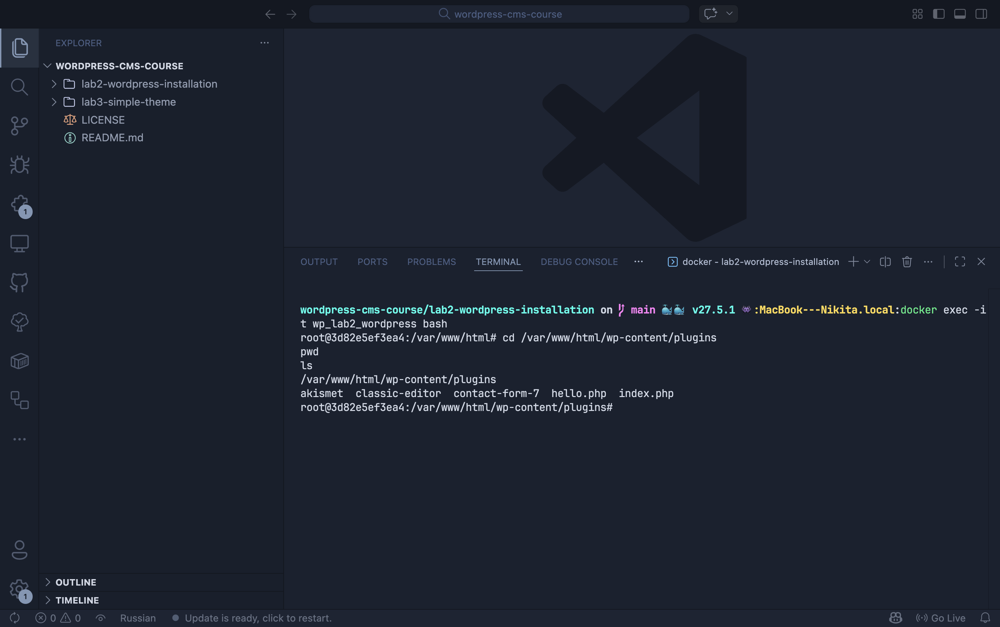
> **Screenshot 1** — Plugin folder structure inside wp-content/plugins.

---

## 🔧 Ход выполнения лабораторной работы

### 1. Подготовка среды и использование существующей WordPress-установки

Для выполнения лабораторной работы я использовал уже существующую локальную установку WordPress, развёрнутую ранее в Docker. Я запустил подготовленные контейнеры WordPress, MySQL и phpMyAdmin и убедился, что сайт и административная панель открываются корректно.

Такой подход позволил мне не выполнять повторную установку WordPress, а сразу перейти к созданию плагина внутри уже настроенной среды.

> 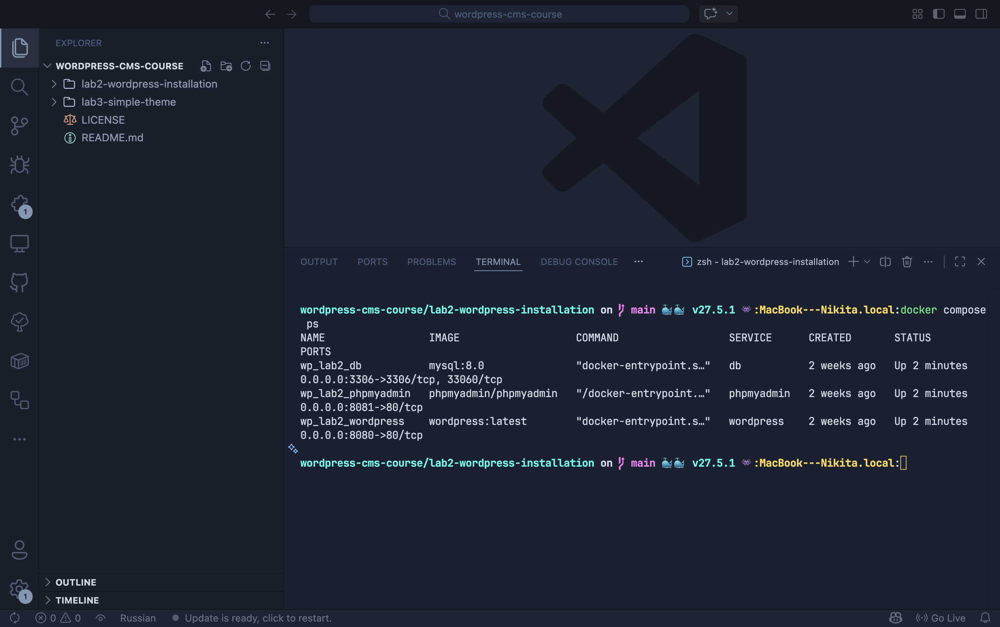
> **Screenshot 2** — Running WordPress, MySQL and phpMyAdmin containers.

---

### 2. Переход в директорию плагинов WordPress

После запуска среды я подключился к контейнеру WordPress через терминал и перешёл в директорию wp-content/plugins, где хранятся все пользовательские и системные плагины WordPress.

В этой директории я создал новую папку usm-notes, которая стала рабочей директорией учебного плагина.

> 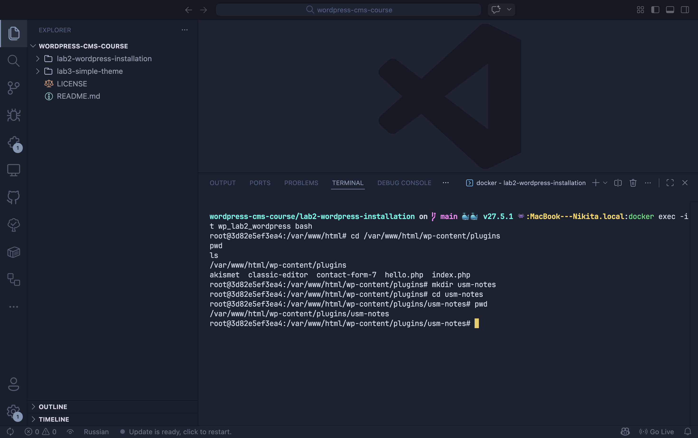
> **Screenshot 3** — New plugin directory in wp-content/plugins.

---

### 3. Проверка режима отладки WordPress

Так как в предыдущей лабораторной работе режим отладки уже был включён, на этом этапе я только проверил, что в файле wp-config.php параметр:

```php
define('WP_DEBUG', true);
```

по-прежнему активен. Это важно, так как в процессе разработки плагина режим отладки помогает своевременно обнаруживать ошибки и предупреждения.

> 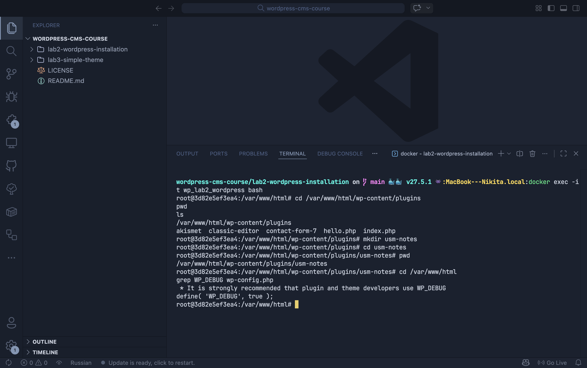
> **Screenshot 4** — Verification of active WP_DEBUG in wp-config.php.

---

### 4. Создание основного файла плагина

В папке usm-notes я создал основной файл плагина usm-notes.php. В начале файла были добавлены стандартные метаданные плагина, содержащие:

- название плагина;
- описание;
- версию;
- автора.

После этого я открыл административную панель WordPress, перешёл в раздел Plugins и убедился, что WordPress распознаёт новый плагин как отдельный компонент.

> 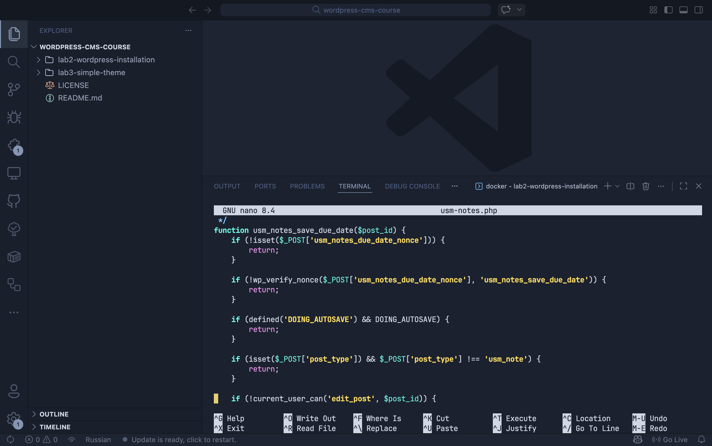
> **Screenshot 5** — Main usm-notes.php file with plugin metadata.

> 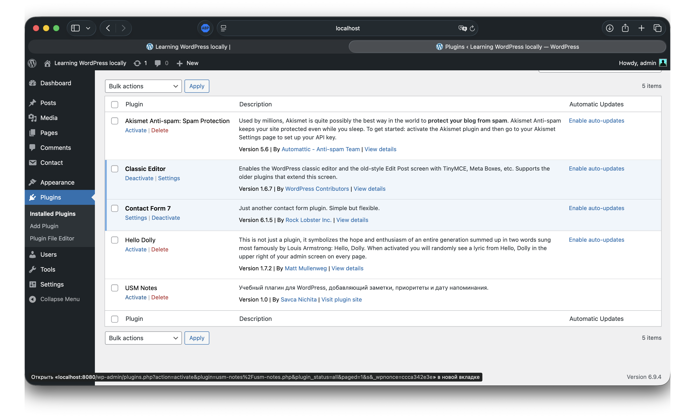
> **Screenshot 6** — USM Notes listed in WordPress plugins section.

---

### 5. Активация плагина

После создания основного файла я активировал плагин через административную панель WordPress в разделе Plugins → Installed Plugins.

После активации я убедился, что плагин подключён корректно, ошибок PHP и предупреждений нет, а WordPress продолжает работать стабильно.

> 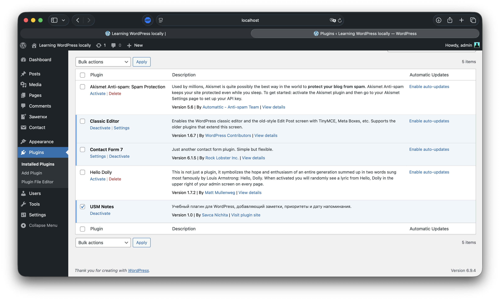
> **Screenshot 7** — Activated USM Notes plugin in the dashboard.

---

### 6. Регистрация Custom Post Type «Заметки»

Следующим этапом я реализовал регистрацию собственного Custom Post Type для заметок. Для этого в плагине была добавлена функция с использованием register_post_type().

Для типа записей usm_note я настроил:

- публичный доступ (public => true);
- наличие архивной страницы (has_archive => true);
- собственную иконку в админке;
- поддержку:
  - заголовка,
  - редактора,
  - автора,
  - миниатюры;
- набор удобных labels для административного интерфейса.

Регистрация CPT была подключена к хуку init, чтобы WordPress создавал новый тип записей при инициализации системы.

После активации плагина в левом меню административной панели появился новый раздел «Заметки».

> 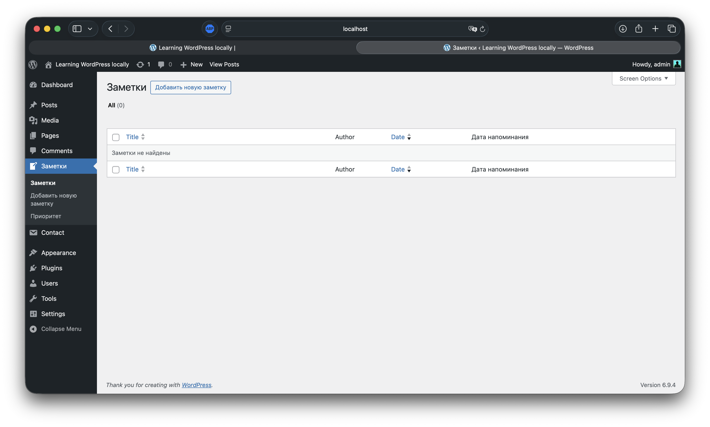
> **Screenshot 8** — New 'Notes' Custom Post Type in WordPress admin.

---

### 7. Регистрация пользовательской таксономии «Приоритет»

После создания CPT я реализовал пользовательскую таксономию Priority с помощью register_taxonomy().

Таксономия была связана с типом записей usm_note и настроена как:

- иерархическая (hierarchical => true), по аналогии с категориями;
- публичная (public => true);
- с набором удобных labels для интерфейса администратора.

После регистрации таксономии в админке WordPress для заметок стал доступен раздел «Приоритет», где я создал три термина:

- High
- Medium
- Low

Это позволило классифицировать заметки по уровню важности.

> 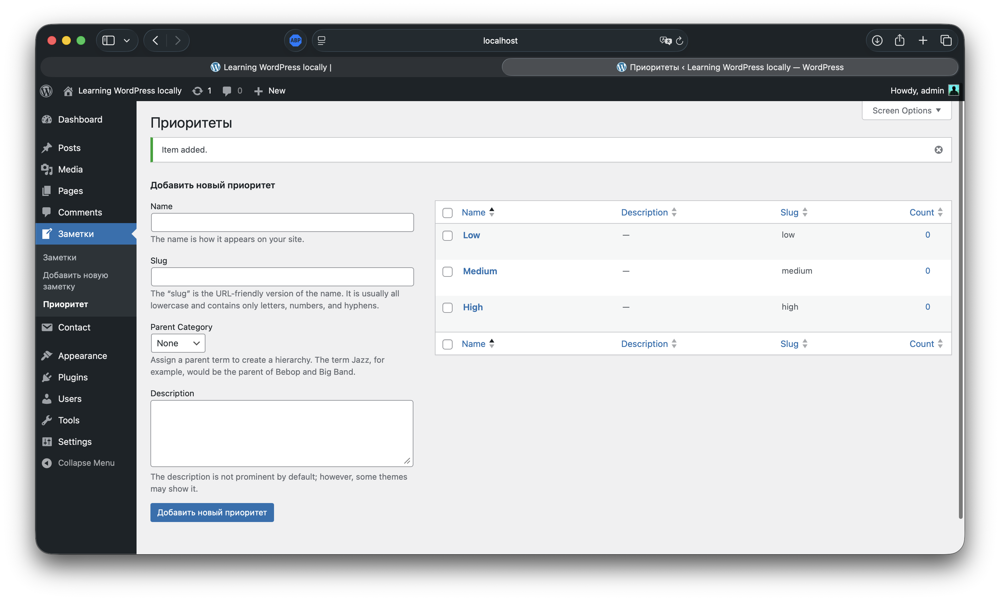
> **Screenshot 9** — Custom Priority taxonomy with terms High, Medium, Low.

---

### 8. Добавление метабокса для даты напоминания

Следующим шагом я реализовал метабокс для поля Due Date. Для этого использовалась функция add_meta_box(), которая добавляла специальный блок в редактор заметок.

В метабоксе я вывел HTML5-поле:

```html
<input type="date" />
```

Это поле предназначалось для хранения даты напоминания и было связано с пользовательским метаполем \_usm_due_date.

После этого при создании и редактировании заметки в админке WordPress справа отображался отдельный блок с полем даты.

> 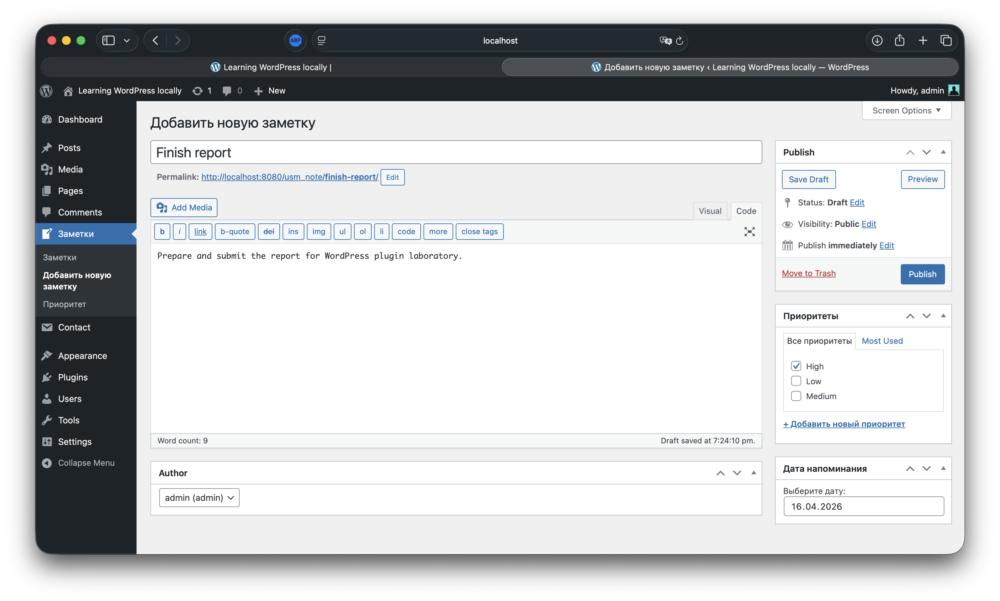
> **Screenshot 10** — Note editor with Due Date meta box and Priority selection.

---

### 9. Сохранение и валидация даты напоминания

После отображения поля даты я реализовал сохранение значения метаполя через хук save_post.

В процессе сохранения были добавлены следующие проверки:

- проверка наличия и корректности nonce;
- защита от автосохранения;
- проверка прав пользователя на редактирование записи;
- проверка обязательности поля даты;
- валидация даты: дата напоминания не должна быть в прошлом.

Если поле не было заполнено, либо была указана дата в прошлом, плагин не сохранял значение и выводил сообщение об ошибке в административной панели.

Если дата была указана корректно, значение сохранялось в метаполе \_usm_due_date и отображалось при повторном редактировании записи.

> 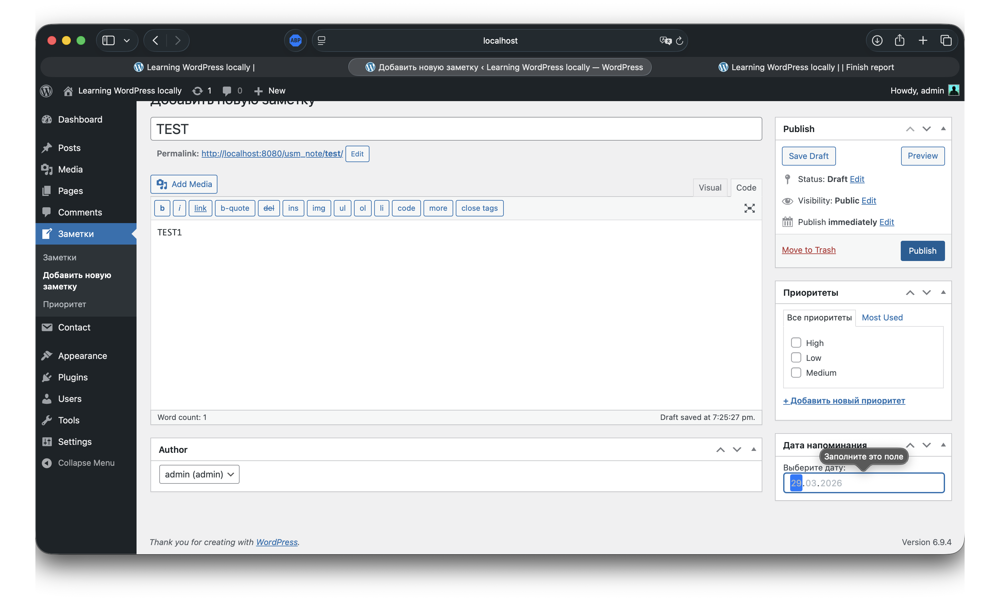
> **Screenshot 11** — Error message when saving note without a due date.

> 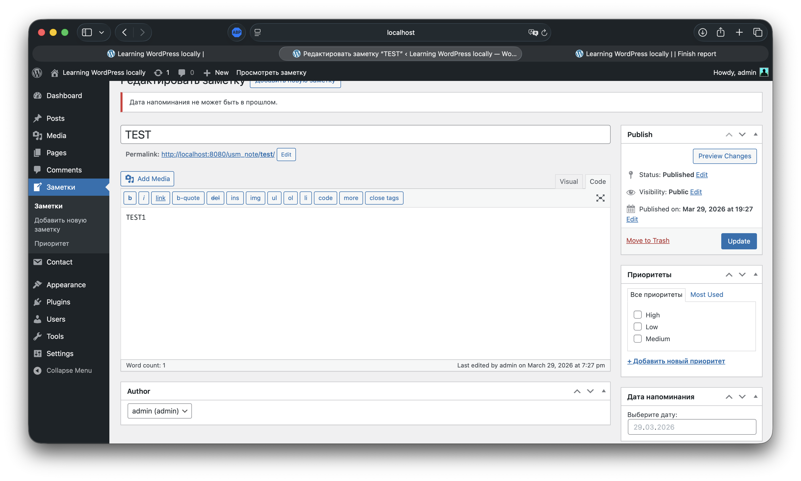
> **Screenshot 12** — Error message when entering a due date in the past.

> 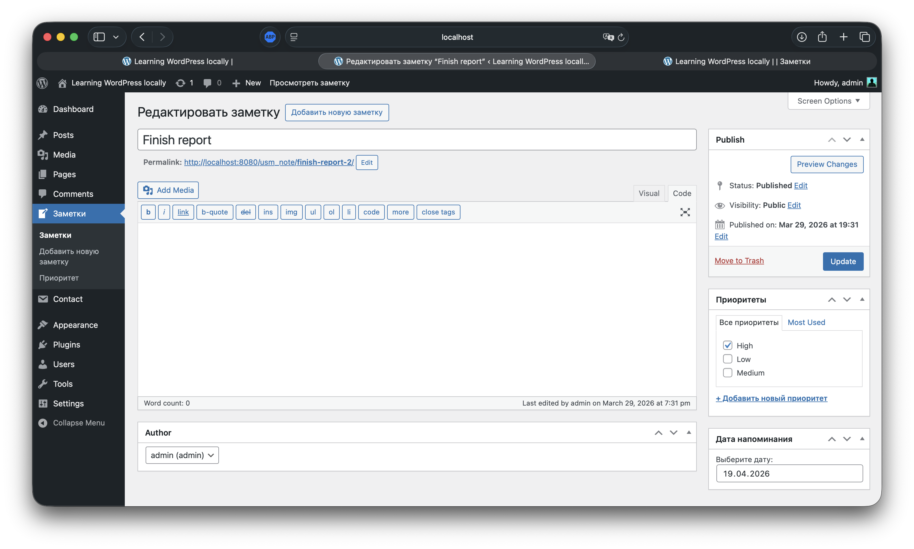
> **Screenshot 13** — Successfully saved and displayed due date.

---

### 10. Отображение даты напоминания в списке заметок

Далее я расширил таблицу записей Custom Post Type usm_note в административной панели и добавил в неё дополнительную колонку Due Date.

Для этого были использованы WordPress hooks для изменения списка колонок и вывода значения метаполя в нужной колонке.

После этого в разделе Заметки → Все заметки у каждой записи стала отображаться дата напоминания, что сделало административный интерфейс более удобным и информативным.

> 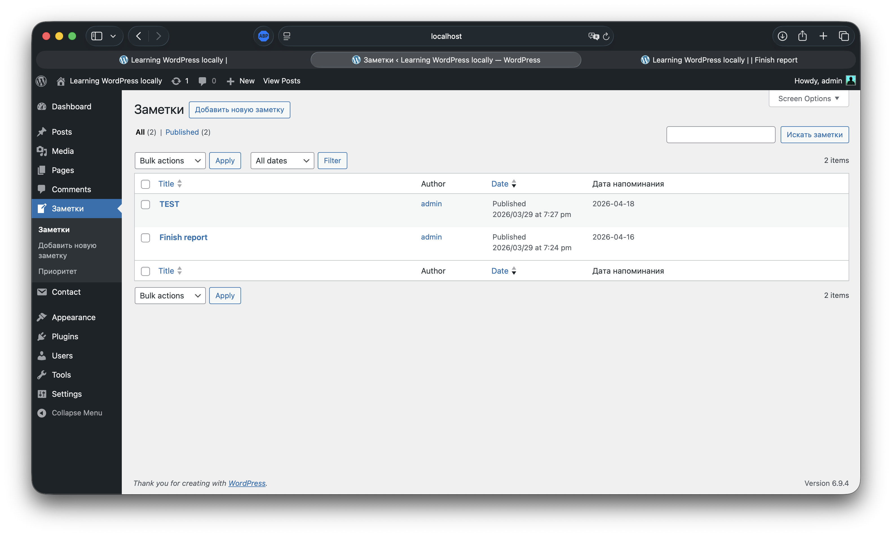
> **Screenshot 14** — Notes list in admin with custom Due Date column.

---

### 11. Создание тестовых заметок

После реализации основной логики плагина я создал 5–6 тестовых заметок с различными значениями:

- разными заголовками;
- разным содержимым;
- разными приоритетами;
- разными датами напоминания.

Каждой заметке был назначен один из приоритетов:

- High
- Medium
- Low

и указана будущая дата напоминания.

Это было необходимо для полноценного тестирования работы шорткода и фильтрации.

> 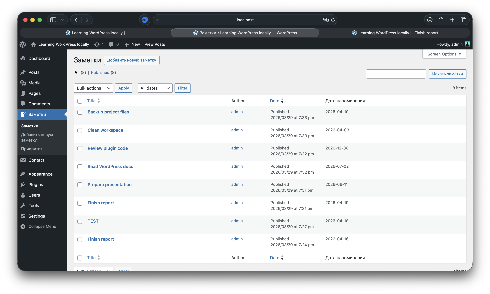
> **Screenshot 15** — List of test notes with various priorities and dates.

---

### 12. Создание шорткода для отображения заметок

Следующим этапом я реализовал шорткод:

```text
[usm_notes]
```

а также его расширенные варианты:

```text
[usm_notes priority="high"]
[usm_notes before_date="2026-04-30"]
```

Для этого в плагине была добавлена функция обработки шорткода с помощью add_shortcode().

Шорткод поддерживал:

- отображение всех заметок;
- фильтрацию по priority;
- фильтрацию по before_date;
- вывод сообщения «Нет заметок с заданными параметрами», если записи по условиям не найдены.

Для выборки заметок использовался WP_Query с tax_query и meta_query в зависимости от переданных атрибутов шорткода.

---

### 13. Добавление стилей для вывода шорткода

Чтобы список заметок на сайте выглядел аккуратно, я добавил стили для вывода карточек заметок. Стили были подключены непосредственно через wp_head() в рамках данного учебного плагина.

Благодаря этому каждая заметка на странице отображалась как отдельный визуальный блок с:

- заголовком;
- кратким текстом;
- приоритетом;
- датой напоминания.

> 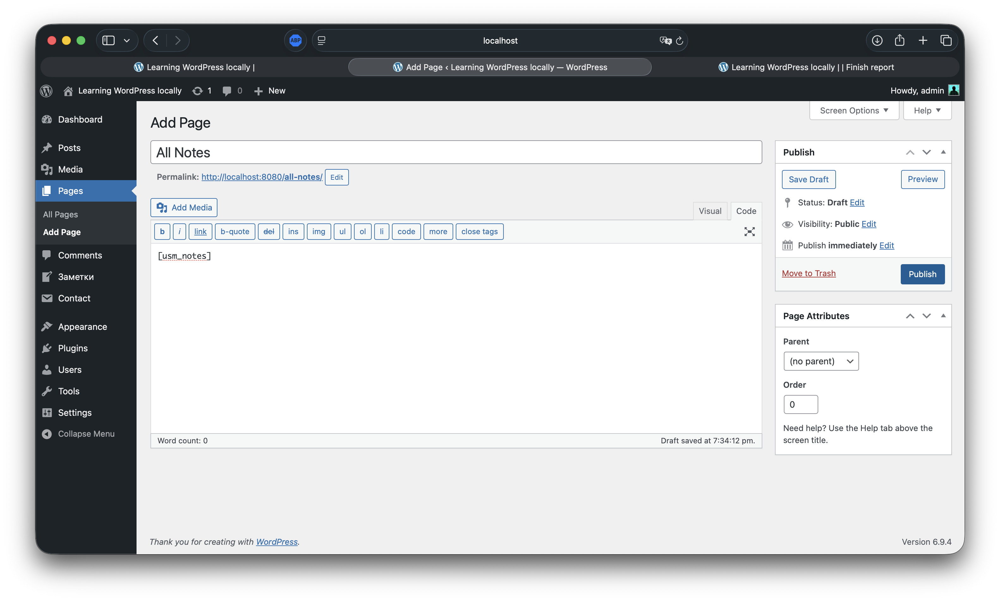
> **Screenshot 16** — 'All Notes' page with [usm_notes] shortcode in editor.

---

### 14. Создание страницы All Notes

Для тестирования шорткода я создал новую страницу WordPress с названием All Notes.

На эту страницу я вставил шорткод:

```text
[usm_notes]
```

После публикации страницы я открыл её на сайте и убедился, что на ней отображаются все созданные заметки.

> 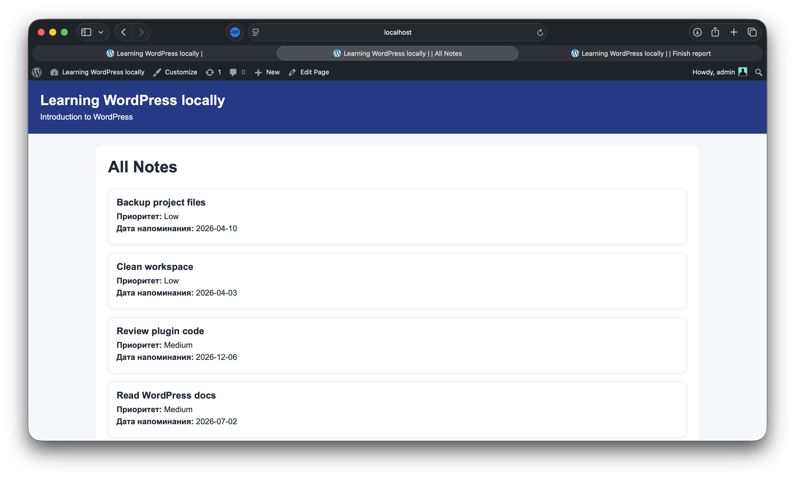
> **Screenshot 17** — Displaying all notes via [usm_notes] on the front-end.

---

### 15. Проверка фильтрации по приоритету

После базового теста я создал ещё одну страницу для проверки фильтрации по приоритету и вставил шорткод:

```text
[usm_notes priority="high"]
```

После открытия страницы на сайте отобразились только заметки с высоким приоритетом. Это подтвердило, что фильтрация через таксономию работает корректно.

> 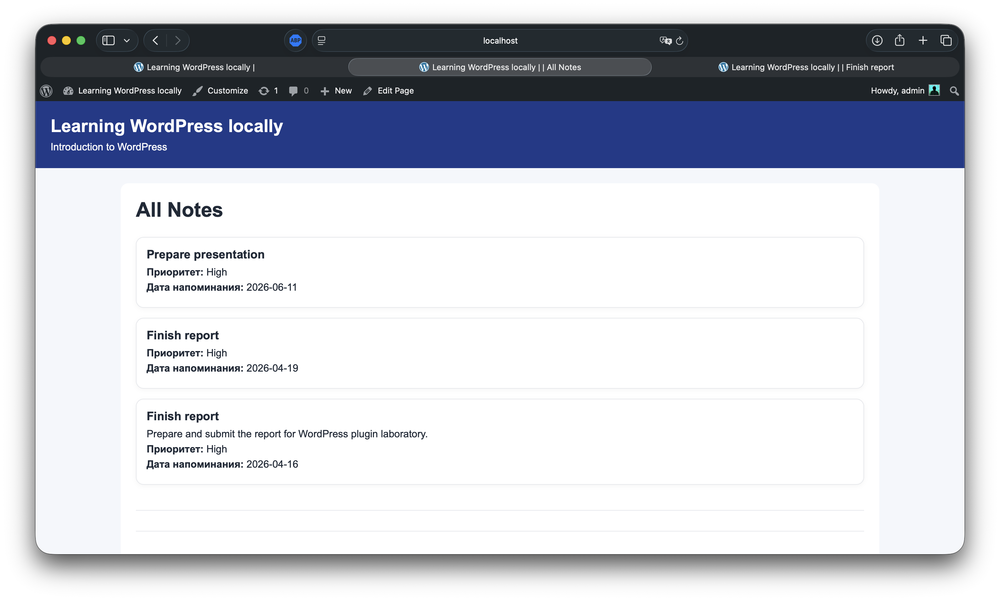
> **Screenshot 18** — Notes filtered by high priority via shortcode attribute.

---

### 16. Проверка фильтрации по дате напоминания

Далее я создал страницу для проверки фильтрации по дате и использовал шорткод вида:

```text
[usm_notes before_date="2026-04-30"]
```

После открытия страницы на сайте были выведены только те заметки, у которых дата напоминания была меньше либо равна указанной дате. Это подтвердило корректную работу фильтрации по метаполю.

> 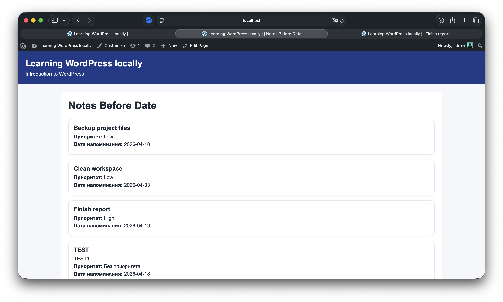
> **Screenshot 19** — Notes filtered by date via [usm_notes before_date=...].

---

### 17. Проверка случая, когда подходящих заметок нет

Также я протестировал ситуацию, когда шорткод вызывается с параметрами, под которые не подходит ни одна заметка.

В этом случае на странице корректно выводилось сообщение:

«Нет заметок с заданными параметрами»

Это важно с точки зрения пользовательского интерфейса, так как страница не оставалась пустой, а показывала понятный результат.

> 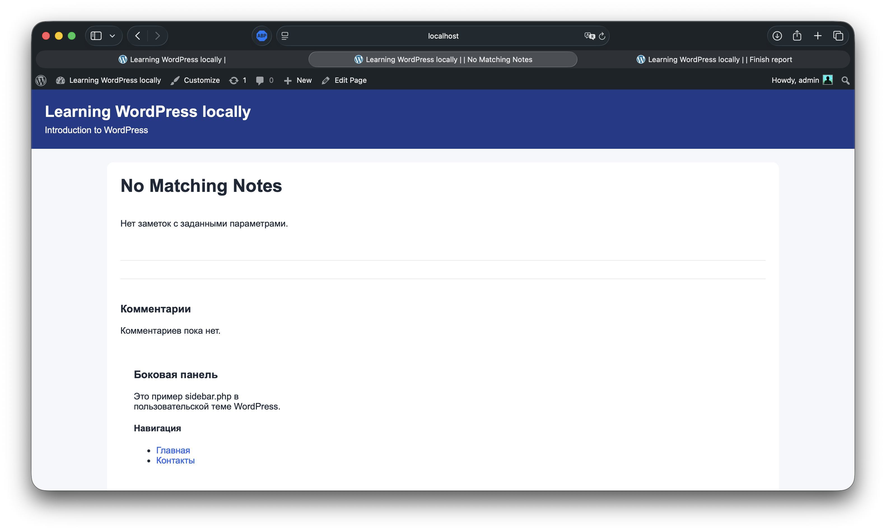
> **Screenshot 20** — 'No notes found' message for empty query results.

---

### 18. Проверка архива заметок

Так как при регистрации Custom Post Type был включён параметр has_archive => true, для заметок стала доступна архивная страница.

Я открыл архив заметок и убедился, что записи CPT корректно доступны на отдельной архивной странице.

> 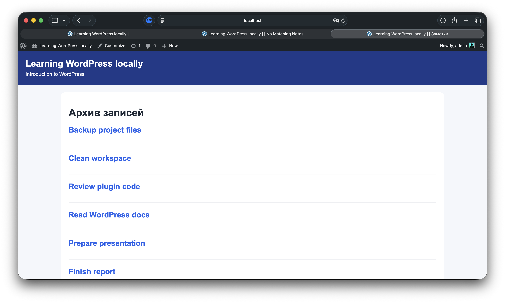
> **Screenshot 21** — Archive page for the 'Notes' Custom Post Type.

---

### 19. Финальная проверка работы плагина

На завершающем этапе я ещё раз последовательно проверил:

- административную панель;
- список заметок;
- форму редактирования заметки;
- сохранение даты;
- список приоритетов;
- работу шорткодов;
- отображение заметок на сайте.

Я убедился, что плагин работает без критических ошибок, корректно отображает данные и выполняет все основные функции, предусмотренные заданием.

> 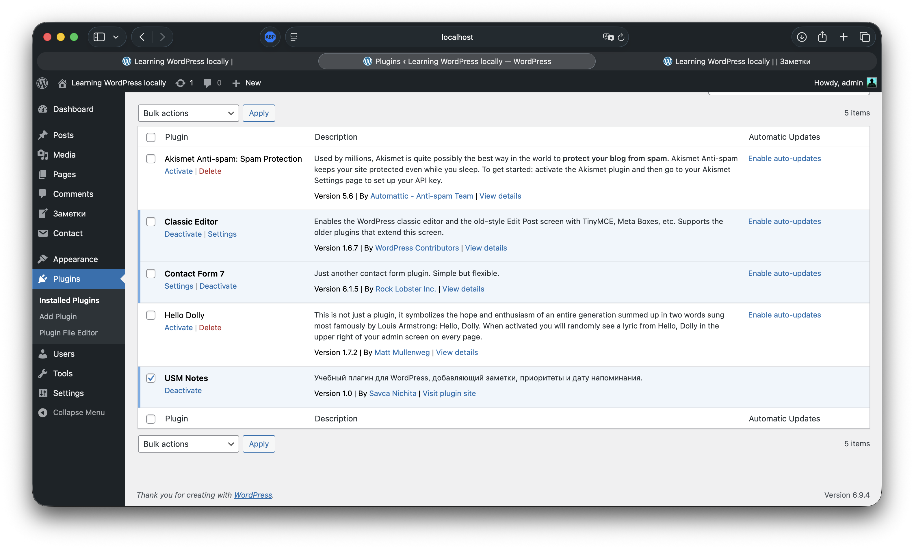
> **Screenshot 22** — Successful verification of USM Notes plugin functionality in admin and front-end.

---

### 20. Подготовка плагина к загрузке в Git

Последним шагом я скопировал папку плагина из Docker-контейнера на локальную файловую систему macOS и подготовил её к загрузке в Git-репозиторий.

> 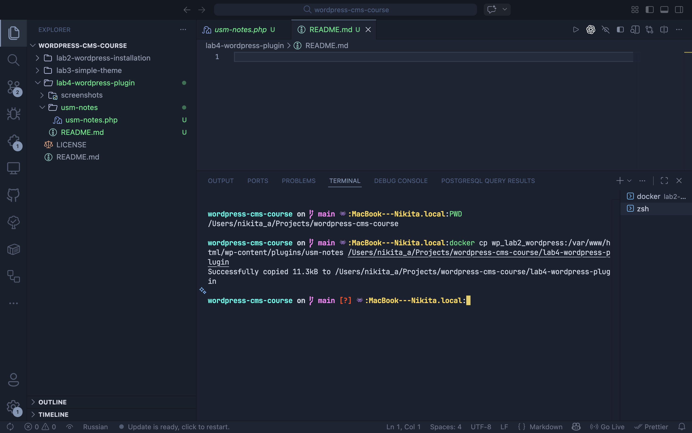
> **Screenshot 23** — USM Notes plugin prepared for Git repository upload.

---

## ✅ Итоги выполнения практической части

В результате выполнения лабораторной работы я:

- использовал существующую локальную установку WordPress в Docker;
- создал собственный WordPress-плагин USM Notes;
- зарегистрировал Custom Post Type для заметок;
- зарегистрировал пользовательскую таксономию Priority;
- добавил метабокс для даты напоминания;
- реализовал безопасное сохранение метаполя с проверкой nonce;
- добавил обязательность даты и валидацию даты на недопустимость значения в прошлом;
- вывел дату напоминания в списке заметок в админке;
- создал шорткод для вывода заметок на сайте;
- реализовал фильтрацию по приоритету и дате;
- протестировал плагин на наборе из 5–6 заметок;
- подготовил плагин к размещению в Git-репозитории.

---

## 📘 Краткая документация к плагину

### Название плагина

USM Notes

### Назначение плагина

Плагин предназначен для учебной лабораторной работы и демонстрирует расширяемую модель данных WordPress через:

- Custom Post Type;
- пользовательскую таксономию;
- метаполя и метабоксы;
- шорткоды.

### Основные возможности

- раздел «Заметки» в админке WordPress;
- таксономия приоритетов High / Medium / Low;
- поле Due Date для даты напоминания;
- проверка даты и защита сохранения через nonce;
- отображение даты в списке заметок;
- шорткод для вывода заметок на страницах сайта.

### Реализованные примеры использования

- [usm_notes] — вывод всех заметок;
- [usm_notes priority="high"] — вывод заметок с высоким приоритетом;
- [usm_notes before_date="2026-04-30"] — вывод заметок с датой напоминания до указанной даты.

---

## 🚀 Инструкции по запуску проекта

Если WordPress уже развёрнут в Docker, для запуска проекта достаточно:

1. Запустить Docker-контейнеры WordPress, MySQL и phpMyAdmin.
2. Убедиться, что WordPress доступен по локальному адресу.
3. Поместить папку usm-notes в директорию:

```text
wp-content/plugins/
```

4. Открыть административную панель WordPress.
5. Перейти в раздел Plugins.
6. Найти плагин USM Notes и активировать его.
7. При необходимости перейти в Settings → Permalinks и нажать Save Changes, чтобы обновить rewrite rules.
8. Создать тестовые заметки и страницы с шорткодами для проверки плагина.

---

## ❓ Контрольные вопросы

| №   | Вопрос                                                                                                                                | Ответ                                                                                                                                                                                                                                                                                                                                                                                                                                                                                                                              |
| --- | ------------------------------------------------------------------------------------------------------------------------------------- | ---------------------------------------------------------------------------------------------------------------------------------------------------------------------------------------------------------------------------------------------------------------------------------------------------------------------------------------------------------------------------------------------------------------------------------------------------------------------------------------------------------------------------------- |
| 1   | Чем пользовательская таксономия принципиально отличается от метаполя? Приведи пример, когда выбрать таксономию, а когда — метаданные. | Пользовательская таксономия используется для классификации и группировки записей. Она подходит, когда одно и то же значение должно переиспользоваться у многих записей и участвовать в фильтрации, навигации и архивах. Например, приоритеты High / Medium / Low лучше хранить как таксономию. Метаполе используется для хранения конкретного дополнительного значения у одной записи. Оно подходит для индивидуальных данных, например даты напоминания, цены, кода или срока выполнения.                                         |
| 2   | Зачем нужен nonce при сохранении метаполей и что произойдёт, если его не проверять?                                                   | Nonce нужен для защиты формы от несанкционированной отправки и атак типа CSRF. Если его не проверять, злоумышленник или сторонний сайт может инициировать нежелательное сохранение данных от имени авторизованного пользователя. Проверка nonce подтверждает, что запрос действительно пришёл из доверенного интерфейса WordPress.                                                                                                                                                                                                 |
| 3   | Какие аргументы register_post_type() и register_taxonomy() чаще всего важны для фронтенда и UX?                                       | Для фронтенда и UX особенно важны: public — определяет, будет ли сущность доступна пользователю и на сайте; has_archive — позволяет формировать архивные страницы и делать контент более доступным; labels — отвечают за понятные подписи в интерфейсе администратора; supports — задаёт, какие элементы доступны в редакторе (заголовок, редактор, автор, миниатюра); hierarchical — влияет на поведение таксономии и удобство группировки; show_in_rest — важно для совместимости с современным редактором Gutenberg и REST API. |

---

## 📷 Сводная таблица скриншотов

| №   | Что должно быть видно                                      |
| --- | ---------------------------------------------------------- |
| 1   | Структура папки плагина usm-notes                          |
| 2   | Запущенные Docker-контейнеры WordPress, MySQL и phpMyAdmin |
| 3   | Папка wp-content/plugins и директория usm-notes            |
| 4   | Проверка параметра WP_DEBUG                                |
| 5   | Содержимое файла usm-notes.php                             |
| 6   | Плагин USM Notes в списке плагинов                         |
| 7   | Активированный плагин USM Notes                            |
| 8   | Раздел Custom Post Type «Заметки» в админке                |
| 9   | Таксономия Priority с терминами High / Medium / Low        |
| 10  | Создание заметки с метабоксом даты и приоритетом           |
| 11  | Ошибка при сохранении заметки без даты                     |
| 12  | Ошибка при указании даты в прошлом                         |
| 13  | Сохранённая дата при повторном редактировании              |
| 14  | Колонка Due Date в списке заметок                          |
| 15  | Список всех тестовых заметок                               |
| 16  | Страница All Notes в редакторе с шорткодом                 |
| 17  | Отображение всех заметок через [usm_notes]                 |
| 18  | Отображение заметок высокого приоритета                    |
| 19  | Отображение заметок по фильтру даты                        |
| 20  | Сообщение «Нет заметок с заданными параметрами»            |
| 21  | Архивная страница заметок                                  |
| 22  | Финальная проверка работы плагина без ошибок               |
| 23  | Плагин, подготовленный к загрузке в Git                    |

---

## 📚 Список использованных источников

1. WordPress.org — Plugin Developer Handbook
2. WordPress.org — Custom Post Types
3. WordPress.org — Taxonomies
4. WordPress.org — Metadata API
5. WordPress.org — Shortcode API
6. WordPress.org — Nonces
7. WordPress.org — add_meta_box / save_post / WP_Query

---

## 🎓 Вывод

В ходе выполнения лабораторной работы №4 я разработал собственный учебный плагин WordPress и на практике изучил основные механизмы расширяемой модели данных WordPress.

Я научился создавать Custom Post Type, регистрировать пользовательскую таксономию, работать с метаполями и метабоксами, выполнять безопасное сохранение данных с использованием nonce, реализовывать базовую валидацию пользовательских данных и выводить записи на сайте через шорткод.

Практическая часть показала, что WordPress предоставляет гибкие инструменты для создания собственных сущностей, структурирования данных и вывода их на фронтенд без изменения ядра системы.

Выполнение данной лабораторной работы позволило мне лучше понять архитектуру WordPress-плагинов и закрепить базовые навыки пользовательской разработки расширений для WordPress.
