# 📚 Лабораторная работа №5

## Безопасность WordPress

WordPress • Docker • Hardening • AIOS • Roles • Backups • Login Lockdown

---

## 📋 Студент

| Параметр          | Значение                                                                   |
| ----------------- | -------------------------------------------------------------------------- |
| Имя и фамилия     | Савка Никита (Savca Nichita)                                               |
| Группа            | I2302                                                                      |
| Рабочая станция   | macOS (MacBook Air, Apple Silicon M3)                                      |
| Среда выполнения  | Docker Desktop, Docker Compose, WordPress, MySQL, phpMyAdmin, браузер, CLI |
| Формат выполнения | Настройка безопасности в уже существующей локальной установке WordPress    |
| Дата выполнения   | 02.04.2026                                                                 |

---

## 🎯 Цель и задачи работы

Целью данной лабораторной работы было закрепить ключевые практики безопасности WordPress и на практике выполнить базовое усиление защиты локального сайта.

В рамках выполнения лабораторной работы требовалось:

- проверить доступ администратора и включённый режим отладки;
- создать тестового пользователя с ролью Автор;
- проверить использование сложных паролей;
- проверить и установить обновления WordPress, тем и плагинов;
- включить автоматические обновления;
- выполнить базовое hardening WordPress;
- установить и настроить плагин All In One WP Security & Firewall (AIOS);
- протестировать защиту от brute force;
- создать резервную копию базы данных;
- выполнить восстановление из резервной копии;
- проверить целостность восстановленных данных.

---

## 📝 Краткое описание выполненной работы

В ходе выполнения лабораторной работы я использовал уже существующую локальную установку WordPress, ранее развёрнутую в Docker. Такой подход позволил не создавать среду заново, а сосредоточиться непосредственно на вопросах безопасности сайта.

В процессе работы я проверил административный доступ, убедился в активности режима WP_DEBUG, создал тестового пользователя с ролью Author, проверил требования к паролям для администраторов, а также выполнил обновление ядра WordPress, тем и плагинов. После этого были включены автоматические обновления и выполнены базовые меры hardening: отключение встроенного файлового редактора, настройка прав доступа к файлам и каталогам, а также защита файла wp-config.php.

Основная часть лабораторной работы была связана с установкой и настройкой плагина All In One WP Security & Firewall. Я настроил защиту входа, ограничения сессий, базовые правила firewall, смену стандартного URL страницы входа, уведомления, проверку прав файловой системы и резервное копирование базы данных. Затем была проведена проверка защиты от brute force на тестовом пользователе и выполнено восстановление данных из резервной копии.

---

## 🛠️ Используемые технологии и инструменты

В процессе выполнения лабораторной работы были использованы:

- macOS на MacBook Air M3;
- Docker Desktop для запуска локальной WordPress-среды;
- Docker Compose для запуска контейнеров;
- WordPress как объект настройки и защиты;
- MySQL как база данных сайта;
- CLI для работы с импортом резервной копии;
- All In One WP Security & Firewall (AIOS) для прикладной настройки защиты;
- CLI / Terminal для изменения wp-config.php, .htaccess и прав доступа;
- Git для подготовки материалов лабораторной работы.

---

## 🧠 Общая идея реализации

В данной лабораторной работе работа велась не с новой установкой WordPress, а с уже существующим учебным сайтом, созданным в предыдущих работах. Это было удобно, так как сайт уже содержал административную учётную запись, тему, плагины и тестовый контент, на котором можно было сразу проверять настройки безопасности.

Подход к реализации был поэтапным. Сначала были проверены базовые вещи: доступ, пользователи, пароли и обновления. Затем была усилена безопасность на уровне самой WordPress-установки через wp-config.php, права доступа и запрет редактирования файлов из административной панели. После этого основная защита была настроена через AIOS: ограничение попыток входа, logout по времени, контроль логинов, файловой системы, firewall, резервное копирование и уведомления.

Финальным этапом стали тестирование защиты от brute force и восстановление данных из резервной копии, что позволило проверить не только наличие настроек безопасности, но и их практическую работоспособность.

---

## 🔧 Ход выполнения лабораторной работы

### 1. Подготовка среды и запуск существующей WordPress-установки

Для выполнения лабораторной работы я использовал ранее подготовленную локальную установку WordPress, развёрнутую в Docker. Я запустил контейнеры WordPress, MySQL и phpMyAdmin и убедился, что все сервисы находятся в рабочем состоянии.

После этого я открыл сайт и административную панель WordPress в браузере и убедился, что вход под учётной записью администратора доступен.

> 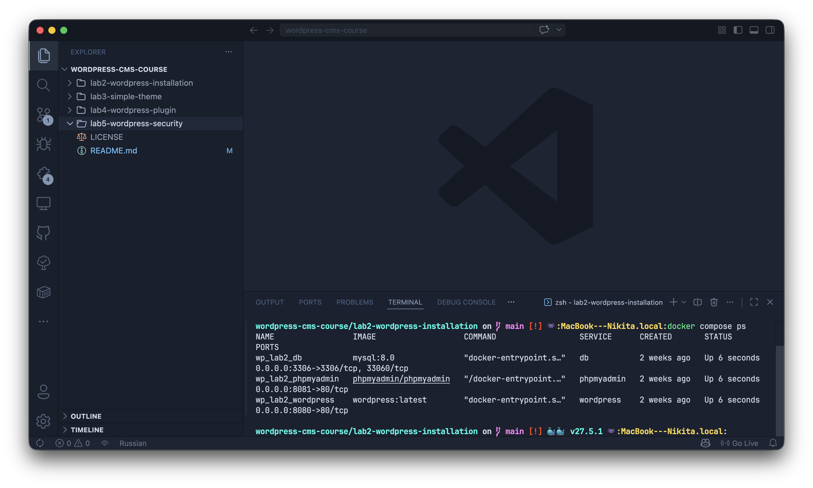
> **Screenshot 1** — Running WordPress, MySQL and phpMyAdmin containers in the terminal.

> 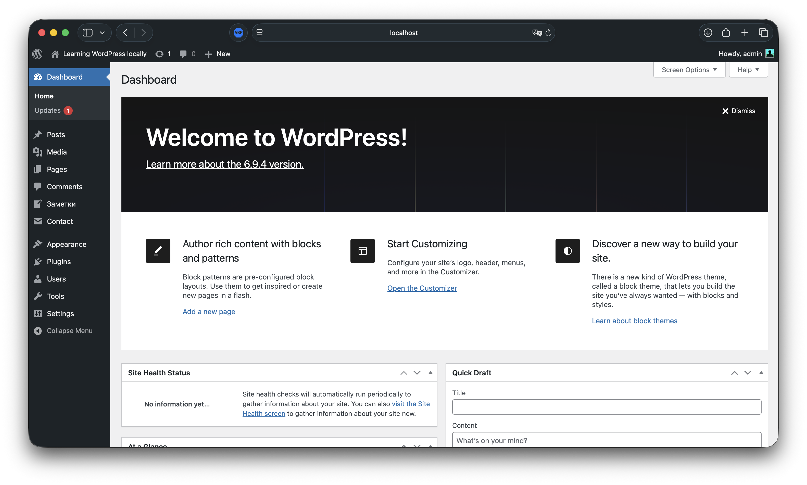
> **Screenshot 2** — WordPress administrative panel after successful login.

---

### 2. Проверка режима отладки WordPress

Следующим шагом я проверил файл wp-config.php и убедился, что режим отладки WordPress включён:

```php
define('WP_DEBUG', true);
```

Эта настройка важна при выполнении лабораторной работы, так как при наличии проблем в конфигурации, плагинах или защите система будет быстрее показывать предупреждения и ошибки, связанные с разработкой и настройкой.

> 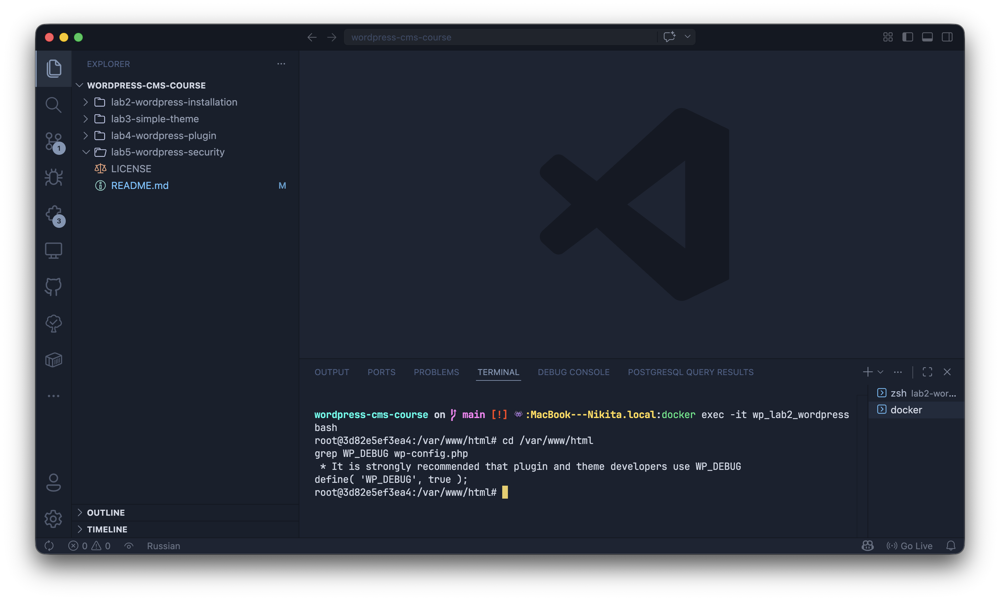
> **Screenshot 3** — Verification of active WP_DEBUG mode in wp-config.php.

---

### 3. Создание тестового пользователя с ролью Author

В административной панели WordPress я перешёл в раздел Users → Add New User и создал тестового пользователя с ролью Автор. Этот пользователь был нужен для дальнейших проверок безопасности, в том числе для теста блокировки входа при brute force.

При создании пользователя я указал отдельный логин, электронную почту и роль Author, после чего сохранил нового пользователя и убедился, что он появился в общем списке пользователей.

> 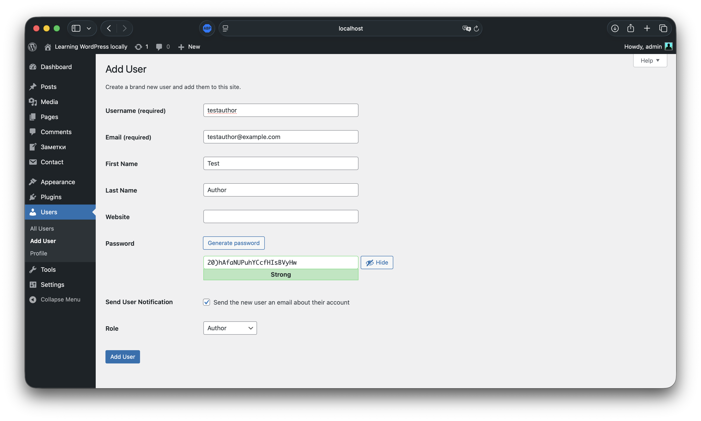
> **Screenshot 4** — Creating a test user with the Author role.

> 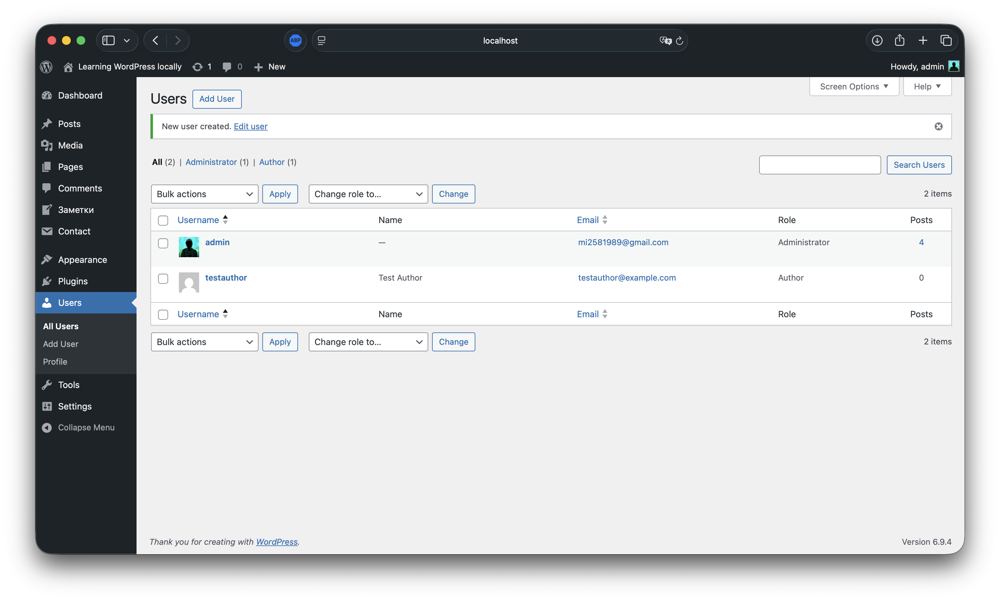
> **Screenshot 5** — WordPress users list showing the new Author user.

---

### 4. Проверка сложных паролей администраторов

После создания тестового пользователя я проверил профили администраторов WordPress и убедился, что для административных учётных записей используются сложные пароли. Проверка выполнялась через профиль пользователя в административной панели.

Я ориентировался на базовые требования безопасности: пароль должен быть длиной не менее 8 символов и содержать комбинацию букв, цифр и специальных символов. Таким образом была подтверждена корректная базовая политика паролей для административных учётных записей.

> 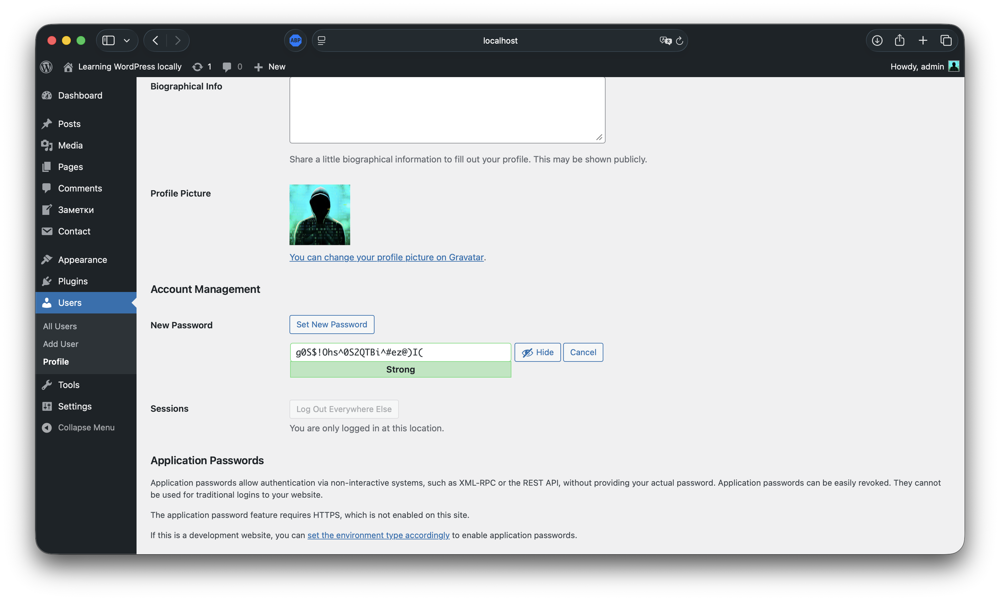
> **Screenshot 6** — Verification of a strong password for the administrator account.

---

### 5. Проверка обновлений WordPress, тем и плагинов

Далее я открыл раздел Dashboard → Updates и проверил наличие доступных обновлений ядра WordPress, тем и плагинов. После этого были установлены все доступные обновления до актуальных версий.

Дополнительно я проверил, что после обновления сайт продолжает работать корректно, административная панель открывается без ошибок, а активная тема и используемые плагины функционируют стабильно.

> 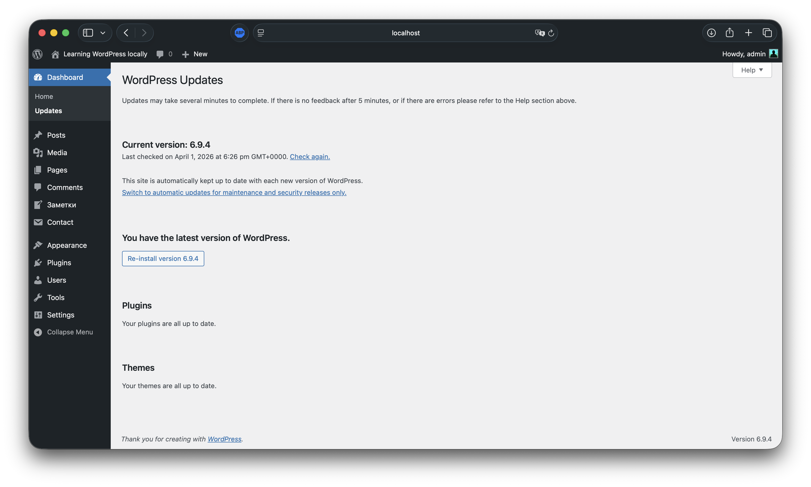
> **Screenshot 7** — Checking for updates in the Dashboard → Updates section.

---

### 6. Настройка автоматических обновлений

После ручной проверки обновлений я включил автоматические обновления для тем и плагинов. Это необходимо для снижения риска использования устаревших компонентов, содержащих известные уязвимости.

В результате WordPress получил возможность автоматически устанавливать свежие версии поддерживаемых тем и плагинов без постоянного ручного вмешательства.

> 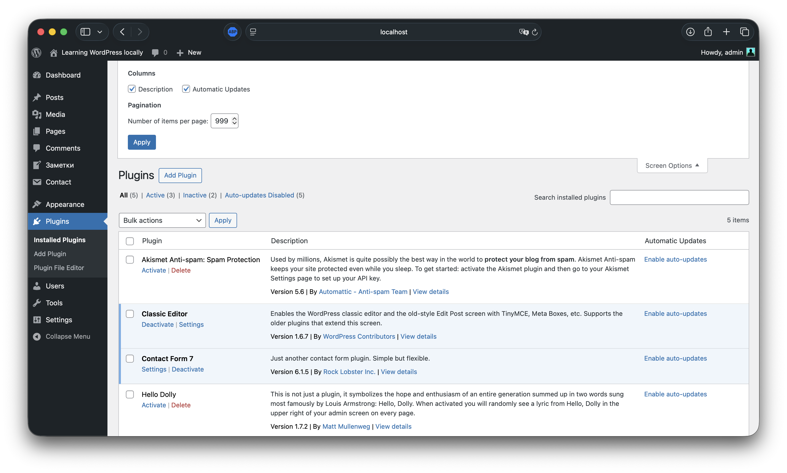
> **Screenshot 8** — Automatic updates enabled for plugins.

> 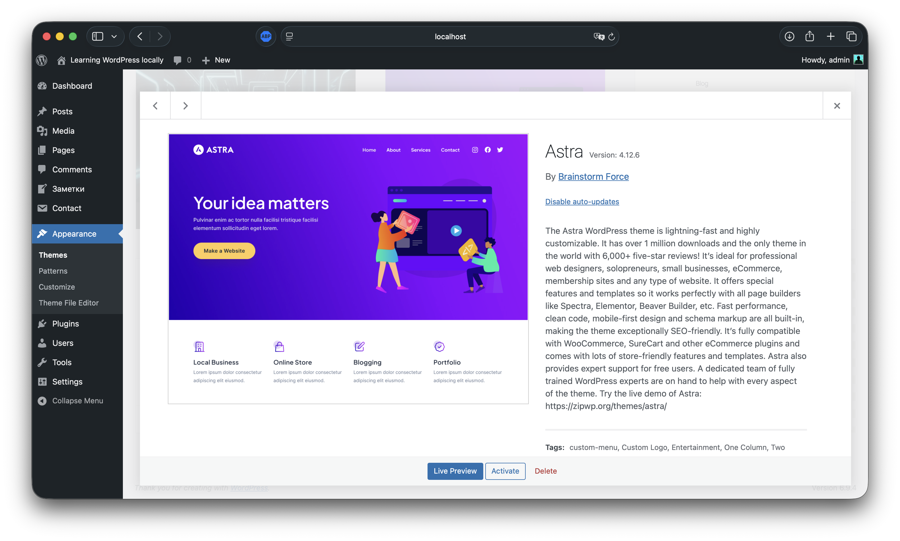
> **Screenshot 9** — Automatic updates enabled for the WordPress theme.

---

### 7. Отключение встроенного редактора файлов

Одним из ключевых шагов hardening стало отключение встроенного редактора файлов WordPress. Для этого в файл wp-config.php была добавлена строка:

```php
define('DISALLOW_FILE_EDIT', true);
```

После применения этой настройки я убедился, что из административной панели исчезли встроенные редакторы файлов тем и плагинов. Это уменьшает риск пост-эксплойта: даже если злоумышленник получит доступ в административную панель, он не сможет сразу изменить PHP-код через встроенный редактор WordPress.

> 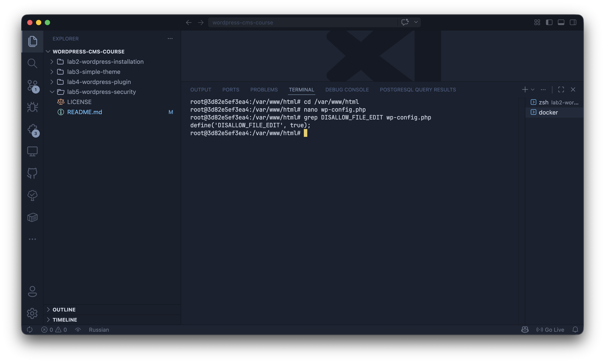
> **Screenshot 10** — Disabling file editor via DISALLOW_FILE_EDIT in wp-config.php.

> 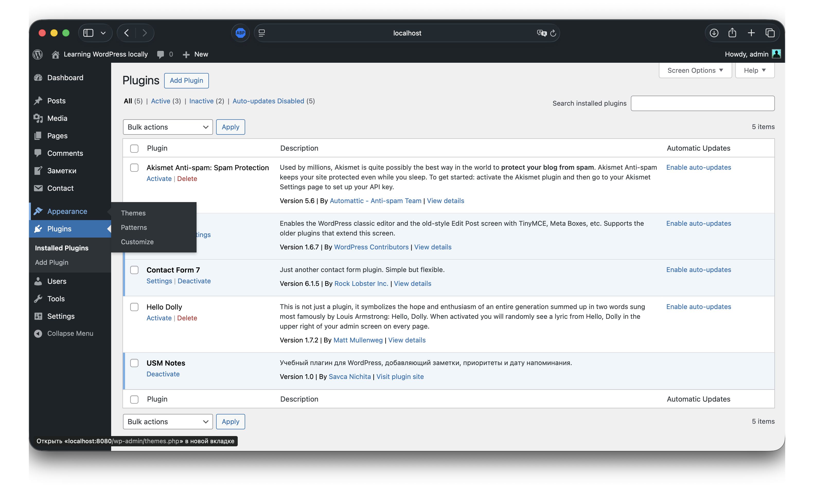
> **Screenshot 11** — Verification of the missing file editor in the admin panel.

---

### 8. Настройка безопасных прав доступа к файлам и папкам

Следующим этапом я настроил стандартные безопасные права доступа для файлов и каталогов WordPress:

- для папок — 755;
- для файлов — 644.

Настройка выполнялась через CLI внутри контейнера WordPress. После применения команд я проверил права на основных объектах файловой системы, включая wp-config.php, каталог wp-content и связанные директории.

Такая конфигурация прав снижает риск несанкционированной записи и делает файловую систему WordPress более безопасной.

> 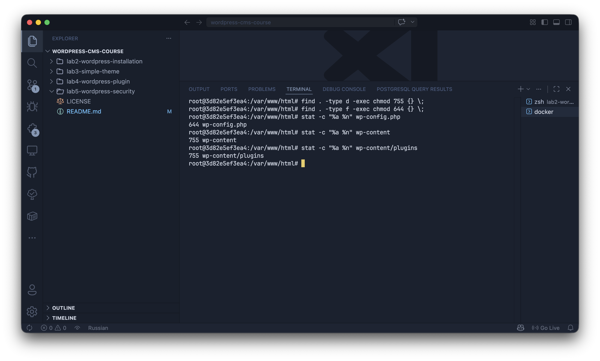
> **Screenshot 12** — Setting and verifying secure file and folder permissions.

---

### 9. Защита файла wp-config.php через .htaccess

После настройки прав доступа я дополнительно усилил защиту файла wp-config.php через правило в .htaccess:

```apache
<files wp-config.php>
order allow,deny
deny from all
</files>
```

Это правило предназначено для ограничения прямого доступа к конфигурационному файлу через веб-сервер. Хотя работа выполнялась в локальной среде, данная мера является частью базовой практики hardening WordPress.

> 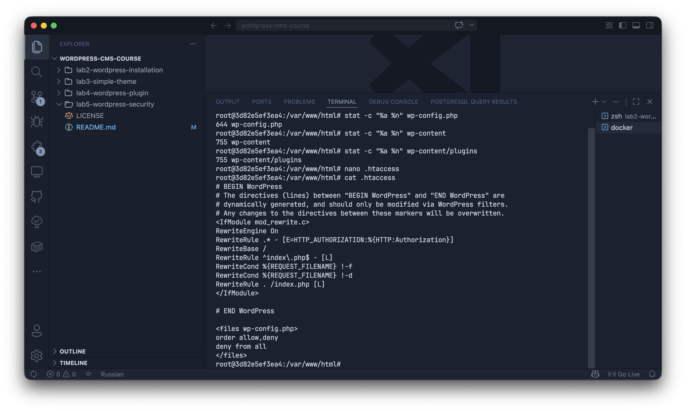
> **Screenshot 13** — Added rule to protect wp-config.php in .htaccess.

---

### 10. Установка и активация All In One WP Security & Firewall

После выполнения базовых мер hardening я перешёл к установке плагина All In One WP Security & Firewall. Для этого в административной панели WordPress был открыт раздел Plugins → Add New, после чего плагин был найден, установлен и активирован.

После активации в меню WordPress появился отдельный раздел настройки безопасности, через который и выполнялась дальнейшая работа.

> 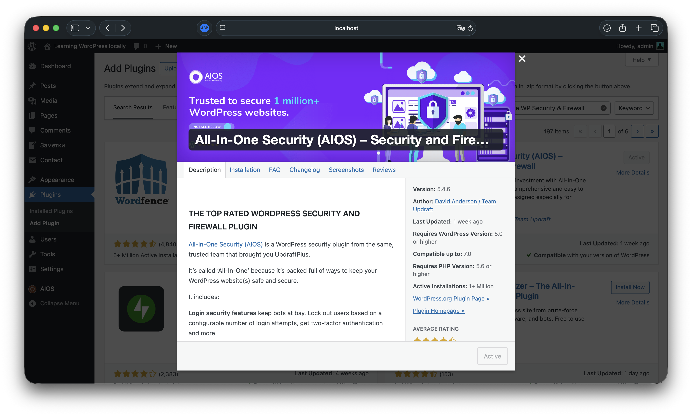
> **Screenshot 14** — Installing the All In One WP Security & Firewall plugin.

> 
> **Screenshot 15** — Activated AIOS plugin in the WordPress dashboard.

---

### 11. Первичная настройка AIOS

После активации я открыл раздел WP Security и убедился, что плагин корректно загружен и отображает основные категории безопасности: управление логинами, файловую систему, firewall, backup, brute force, scanner и уведомления.

Эта панель стала основным рабочим инструментом для оставшейся части лабораторной работы.

> 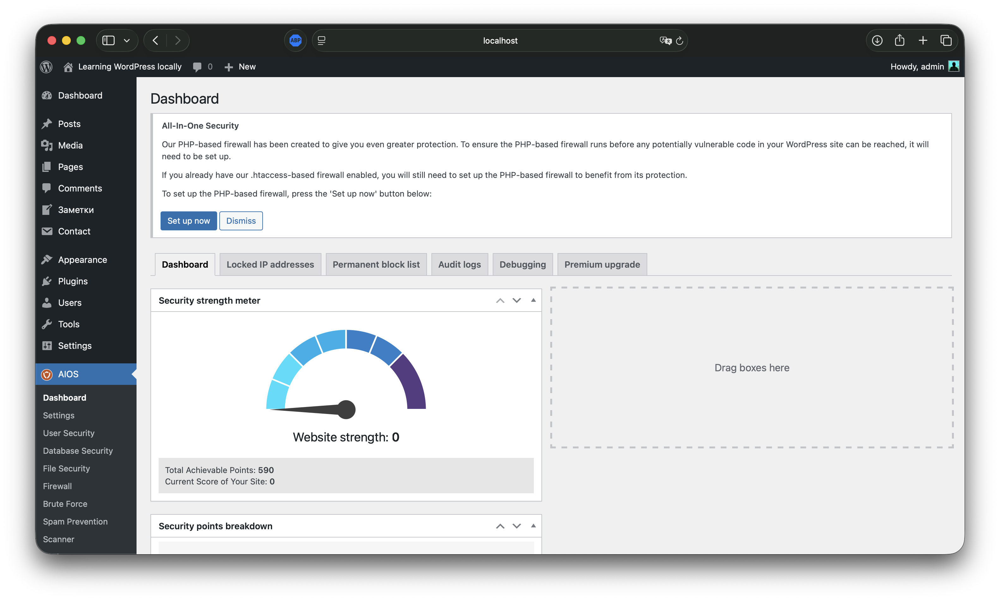
> **Screenshot 16** — Main AIOS security dashboard in WordPress.

---

### 12. Настройка Login Lockdown

В разделе User Login была включена функция Login Lockdown. Для тестовой конфигурации были заданы следующие параметры:

- Max Login Attempts — 5;
- Login Retry Time Period — 15 минут;
- Lockout Time — 30 минут.

Эти значения были выбраны как разумный баланс между безопасностью и удобством использования: они позволяют быстро выявлять попытки перебора пароля, но при этом не делают систему чрезмерно неудобной для обычных пользователей.

> 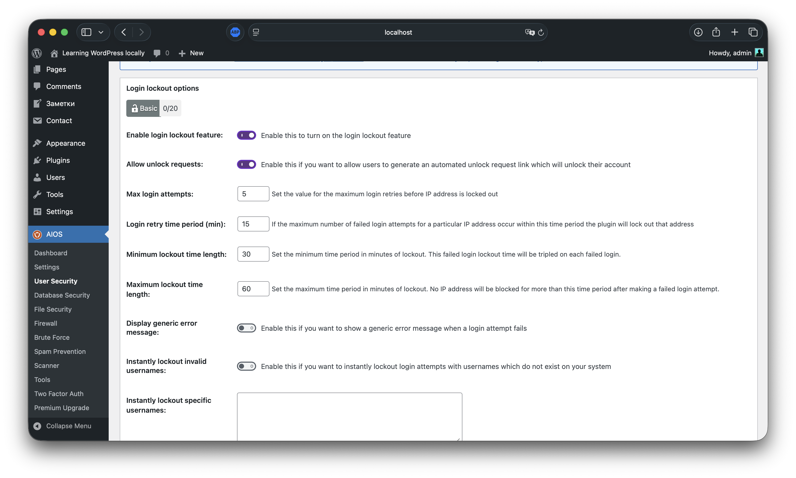
> **Screenshot 17** — Configuration of Login Lockdown settings in AIOS.

---

### 13. Настройка Force Logout

Далее я включил функцию Force Logout, которая завершает слишком длительные пользовательские сессии. В качестве демонстрационного значения был установлен период 24 часа.

Эта мера ограничивает риск использования «вечных» сессий и уменьшает вероятность компрометации старых открытых авторизованных сессий.

> 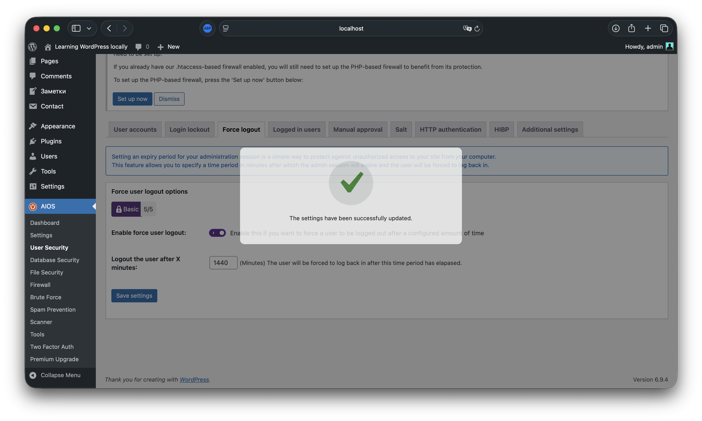
> **Screenshot 18** — Configuration of forced session termination in AIOS.

---

### 14. Проверка логинов пользователей и регистрации

В разделе User Accounts я проверил, что в системе отсутствует небезопасный логин admin. После этого в разделе User Registration были просмотрены настройки регистрации новых пользователей. Если регистрация открыта, в такой конфигурации должна использоваться более безопасная модель одобрения; если регистрация не используется, её следует оставить максимально ограниченной.

Таким образом была проверена базовая безопасность пользовательских учётных записей и регистрационного процесса.

> 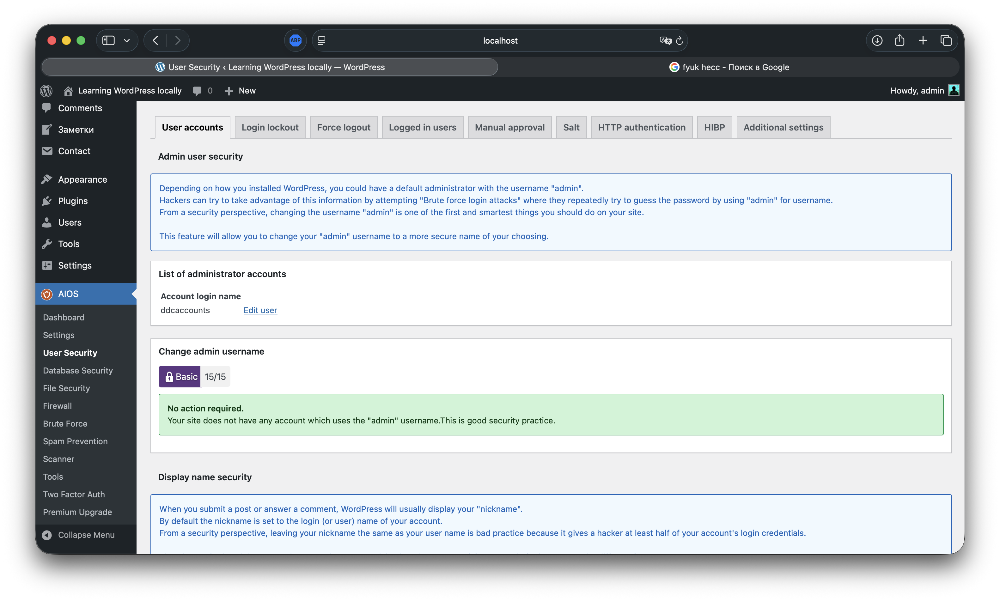
> **Screenshot 19** — Verification that no insecure 'admin' username exists.

> 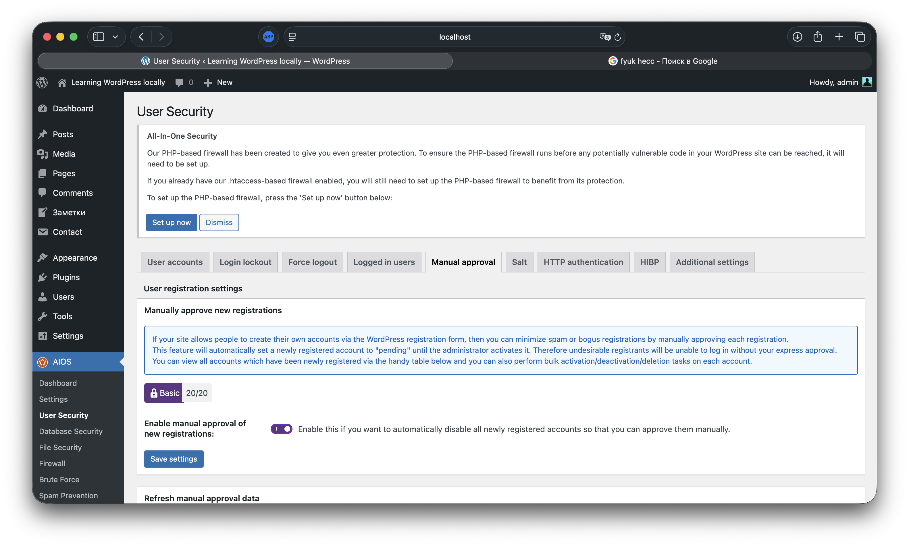
> **Screenshot 20** — Verification and configuration of user registration parameters.

---

### 15. Проверка файловой системы в AIOS

В разделе Filesystem Security я запустил встроенную проверку прав доступа и убедился, что файловая система WordPress соответствует безопасной конфигурации и не использует опасные world-writable права.

Этот шаг дублировал и подтверждал ранее выполненную ручную настройку прав через CLI.

> 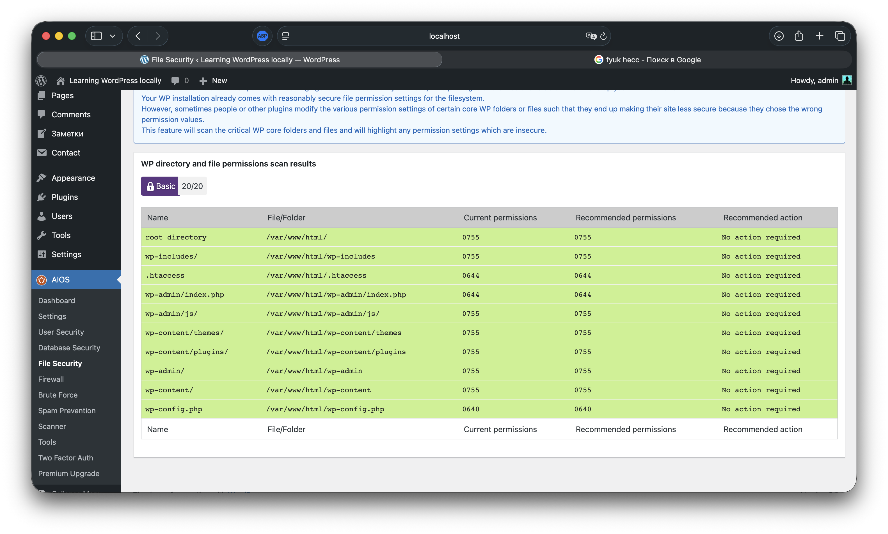
> **Screenshot 21** — Filesystem permissions check via AIOS interface.

---

### 16. Настройка базового Firewall

В разделе Firewall была включена базовая защита плагина AIOS. Дополнительно были активированы безопасные параметры, связанные с фильтрацией подозрительных запросов и базовой защитой от типовых атак, таких как bad query strings, элементы XSS и directory browsing.

На этом этапе использовался именно базовый уровень firewall, без чрезмерно агрессивных ограничений, чтобы сохранить рабочее состояние локального сайта.

> 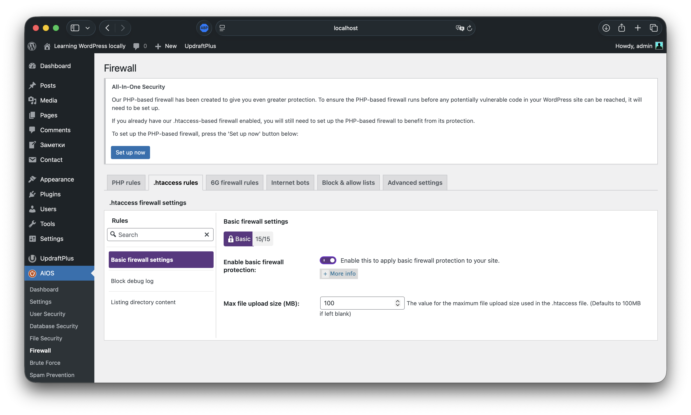
> **Screenshot 22** — Enabling basic firewall and core protection rules in AIOS.

---

### 17. Смена стандартного URL входа

Одной из наиболее заметных мер защиты стала смена стандартного URL входа в WordPress. В разделе Brute Force я активировал функцию Rename Login Page и заменил стандартный путь /wp-login.php на нестандартный безопасный URL.

После сохранения изменений я отдельно проверил новый адрес входа и убедился, что форма авторизации открывается по новому пути. Новый URL был сохранён отдельно, чтобы не потерять доступ к сайту.

> 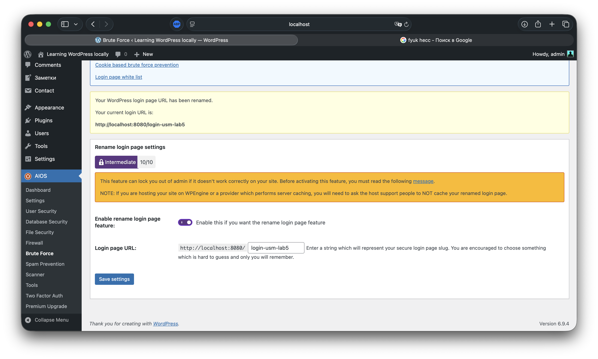
> **Screenshot 23** — Configuration of a custom WordPress login URL.

> 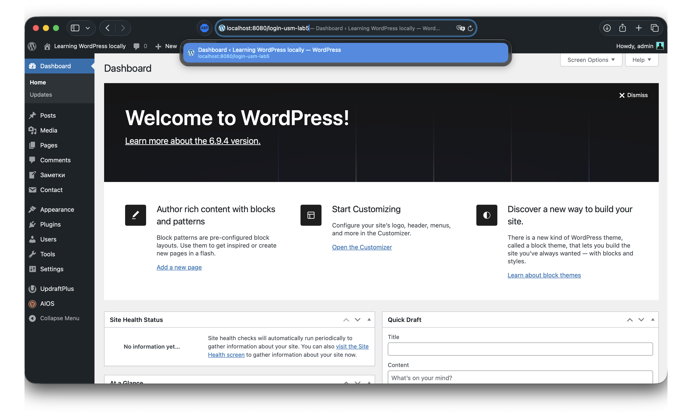
> **Screenshot 24** — WordPress login form accessible via the new non-standard URL.

---

### 18. Настройка отслеживания изменений файлов

Следующим этапом я открыл раздел Scanner / File Change Detection и включил отслеживание изменений файлов сайта. Эта функция позволяет фиксировать изменения в файловой системе WordPress и уведомлять администратора о подозрительной активности.

Для важных событий были включены email-уведомления, чтобы система могла сообщать о потенциально опасных изменениях.

> 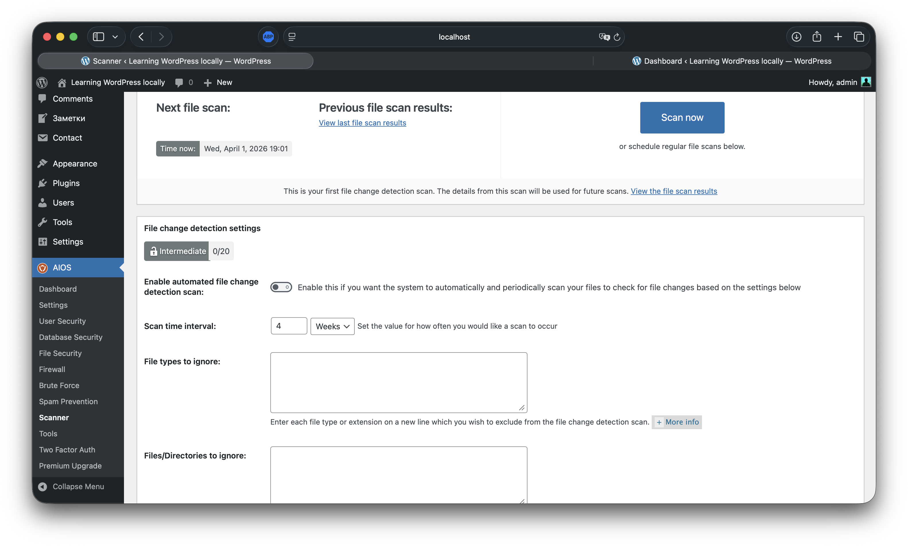
> **Screenshot 25** — Configuration of file change detection scanner in AIOS.

---

### 19. Создание резервной копии базы данных

После настройки средств защиты я перешёл к резервному копированию в разделе Database Backup. На этом этапе была создана резервная копия базы данных WordPress, которая затем использовалась для проверки восстановления.

Резервное копирование базы данных является одной из ключевых мер безопасности, так как позволяет восстановить сайт после ошибок, неудачных изменений или компрометации данных.

> 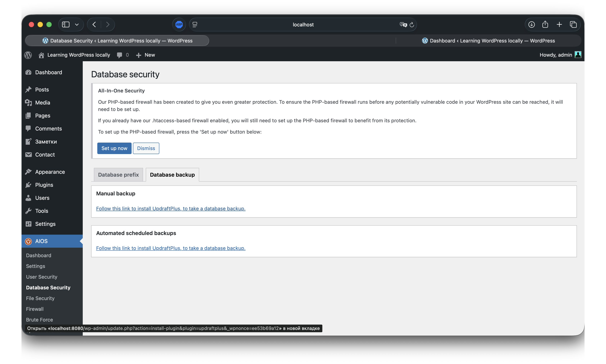
> **Screenshot 26** — Database backup section in AIOS before creation.

> 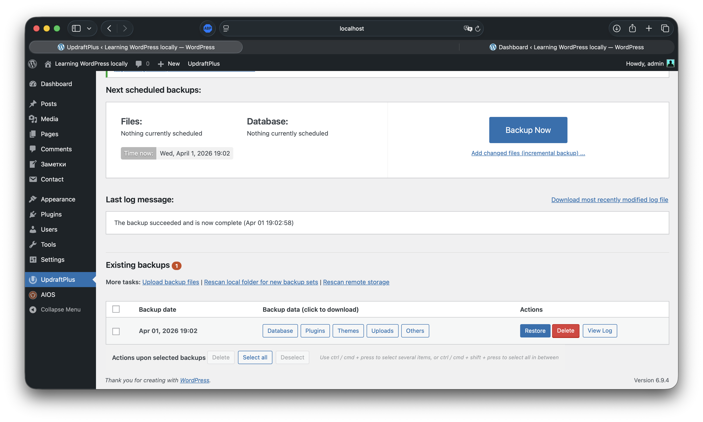
> **Screenshot 27** — Successfully created database backup file.

---

### 20. Настройка уведомлений безопасности

В разделе уведомлений AIOS я включил email-уведомления для важных событий безопасности, включая блокировки, изменения файлов и другие критичные действия.

Эта настройка позволяет быстрее замечать необычную активность и реагировать на потенциальные угрозы.

> 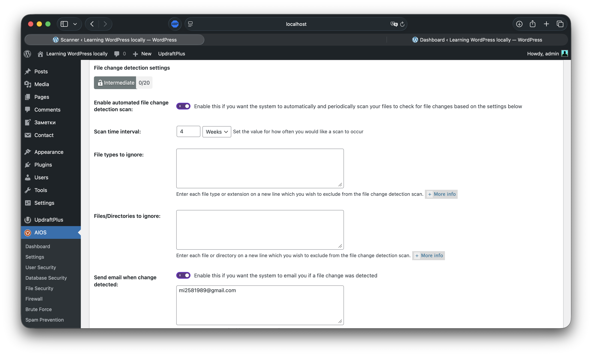
> **Screenshot 28** — Security event email notifications setup in AIOS.

---

### 21. Проверка защиты от brute force

После настройки Login Lockdown и смены URL входа я провёл тест защиты от brute force. Для этого в отдельном приватном окне браузера был открыт новый адрес страницы входа, после чего под тестовым пользователем Author были выполнены многократные попытки входа с неправильным паролем.

После 5–6 неудачных попыток защита AIOS сработала, и для пользователя/IP была зафиксирована блокировка. Затем я открыл логи AIOS и убедился, что событие Lockdown корректно записано в журнал.

> 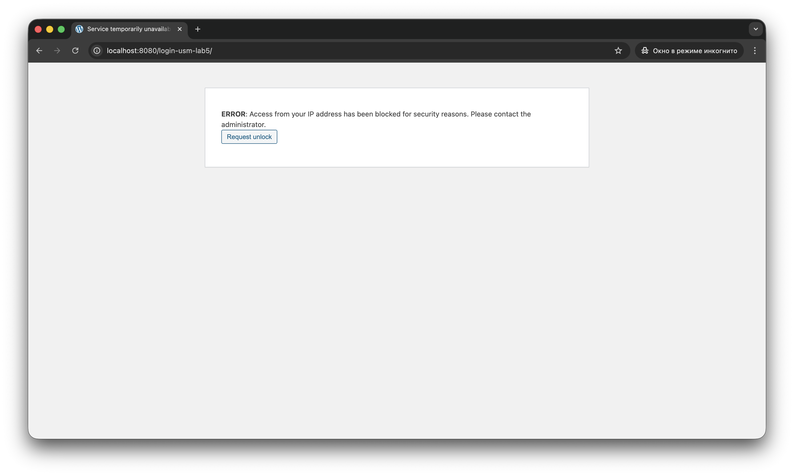
> **Screenshot 29** — Brute force protection test via multiple failed login attempts.

> 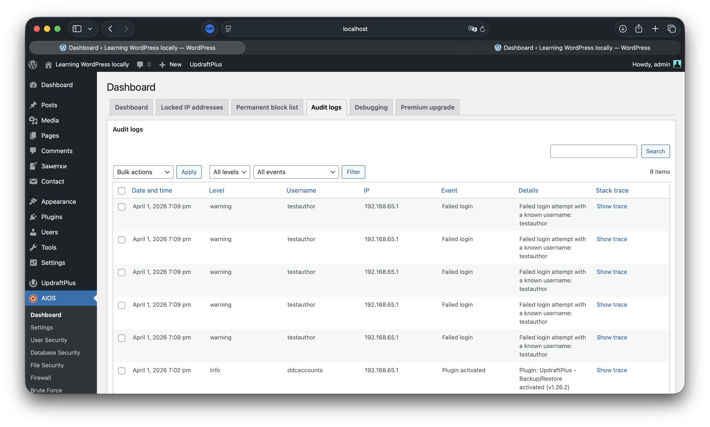
> **Screenshot 30** — Lockdown event record in AIOS logs after activation.

---

### 22. Проверка восстановления из резервной копии

На завершающем этапе была проведена практическая проверка восстановления. Для этого я удалил тестовую запись и один объект, связанный с медиаданными, после чего выполнил импорт резервной копии базы данных через CLI.

После восстановления я проверил целостность данных и убедился, что данные, хранящиеся в базе, были восстановлены. При этом отдельно был сделан вывод, что для полного восстановления WordPress недостаточно резервной копии только базы данных: в полноценный backup также должны входить файлы uploads, темы, плагины и другие данные файловой системы.

> 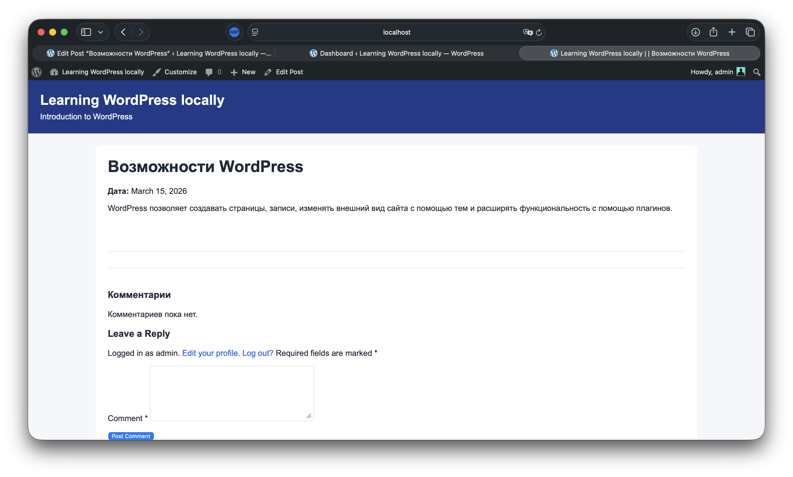
> **Screenshot 31** — Test data before deletion for restoration check.

> 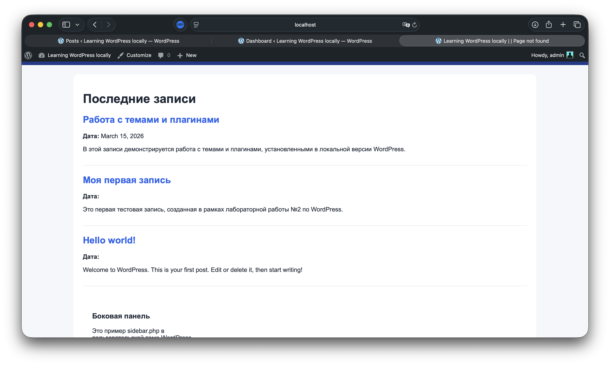
> **Screenshot 32** — Deletion of test post and media before restoration.

> 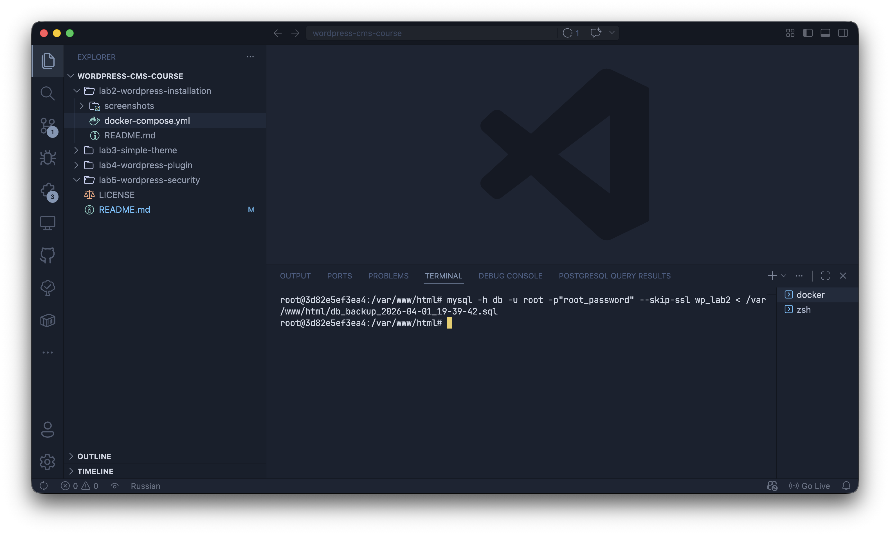
> **Screenshot 33** — Importing SQL backup via command line.

> 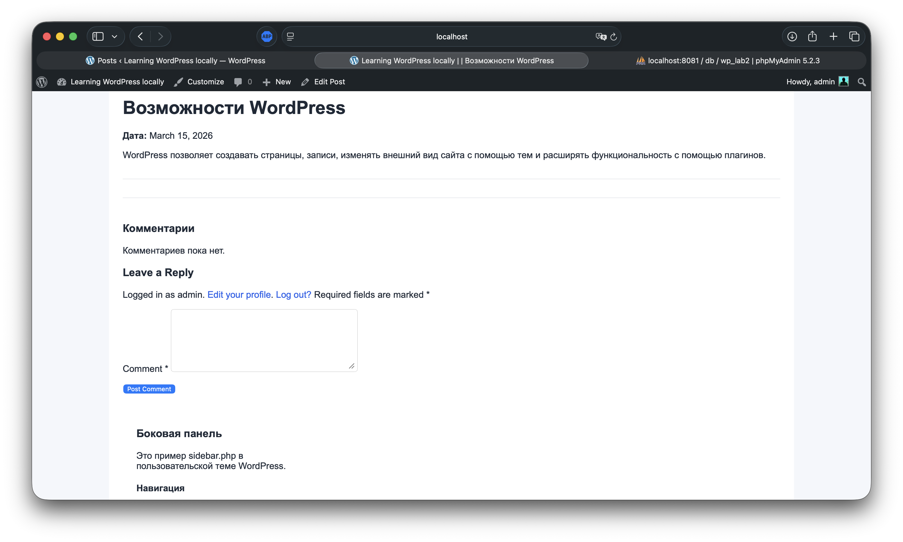
> **Screenshot 34** — Success message after database restoration.

> 
> **Screenshot 35** — Verification of data integrity after restoration.

---

## ✅ Итоги выполнения практической части

В результате выполнения лабораторной работы я:

- использовал существующую локальную установку WordPress в Docker;
- проверил административный доступ и включённый режим WP_DEBUG;
- создал тестового пользователя с ролью Author;
- проверил использование сложных паролей для администраторов;
- выполнил проверку и установку обновлений WordPress, тем и плагинов;
- включил автоматические обновления;
- отключил встроенный редактор файлов WordPress;
- настроил безопасные права доступа для файлов и каталогов;
- защитил wp-config.php через .htaccess;
- установил и настроил плагин All In One WP Security & Firewall;
- включил Login Lockdown, Force Logout, базовый Firewall и мониторинг файлов;
- изменил стандартный URL входа;
- протестировал срабатывание блокировки при brute force;
- создал резервную копию базы данных;
- выполнил восстановление из backup и проверил целостность данных;
- подготовил материалы лабораторной работы к загрузке в Git.

---

## 📘 Краткая документация к настройке безопасности

### Назначение работы

Данная лабораторная работа посвящена базовой защите WordPress и демонстрирует практический набор действий, который применяется для повышения безопасности сайта.

### Основные реализованные меры защиты

- сложные пароли и контроль пользовательских ролей;
- регулярные обновления ядра, тем и плагинов;
- автоматические обновления;
- запрет встроенного редактирования файлов;
- безопасные права доступа к файлам и каталогам;
- ограничение доступа к wp-config.php;
- ограничение попыток входа и блокировка brute force;
- нестандартный URL страницы входа;
- резервное копирование базы данных;
- уведомления о важных событиях безопасности;
- отслеживание изменения файлов.

### Использованный плагин безопасности

All In One WP Security & Firewall (AIOS)

### Настроенные функции AIOS

- Login Lockdown;
- Force Logout;
- User Accounts;
- User Registration;
- Filesystem Security;
- Basic Firewall;
- Rename Login Page;
- File Change Detection;
- Database Backup;
- Notifications.

---

## 🚀 Инструкции по запуску проекта

Для повторного запуска лабораторной работы достаточно:

1. Запустить Docker-контейнеры WordPress, MySQL и phpMyAdmin.
2. Открыть локальный WordPress-сайт и административную панель.
3. Убедиться, что используется административная учётная запись.
4. Проверить настройки WP_DEBUG и DISALLOW_FILE_EDIT.
5. Убедиться, что установлен и активирован AIOS.
6. Проверить конфигурацию безопасности в административной панели.
7. При необходимости создать тестового пользователя и повторить тест Lockdown.
8. Для восстановления резервной копии использовать CLI и импорт SQL-файла.

---

## ❓ Контрольные вопросы

| №   | Вопрос                                                                                                           | Ответ                                                                                                                                                                                                                                                                                                                                                                                                                                                          |
| --- | ---------------------------------------------------------------------------------------------------------------- | -------------------------------------------------------------------------------------------------------------------------------------------------------------------------------------------------------------------------------------------------------------------------------------------------------------------------------------------------------------------------------------------------------------------------------------------------------------- |
| 1   | Почему DISALLOW_FILE_EDIT и правильные права на wp-config.php существенно уменьшают риск пост-эксплойта?         | Параметр DISALLOW_FILE_EDIT отключает встроенный редактор файлов WordPress, поэтому даже при получении доступа к административной панели злоумышленник не сможет сразу изменить PHP-код темы или плагина через интерфейс WordPress. Правильные права доступа и защита wp-config.php дополнительно уменьшают вероятность несанкционированной записи и чтения критически важного конфигурационного файла, в котором содержатся чувствительные параметры системы. |
| 2   | Какие параметры Login Lockdown/Firewall были выбраны и почему именно такие?                                      | Для демонстрационной настройки были выбраны параметры: Max Login Attempts = 5, Login Retry Time Period = 15 min, Lockout Time = 30 min, а также базовый уровень Firewall. Эти значения обеспечивают разумный баланс между безопасностью и UX: защита от перебора уже работает, но при этом легитимный пользователь не блокируется слишком быстро и надолго из-за одной случайной ошибки.                                                                       |
| 3   | Чем отличаются меры защиты на уровне WordPress от мер на уровне веб-сервера и ОС?                                | Меры на уровне WordPress работают внутри самого приложения: это плагины безопасности, роли пользователей, nonce, блокировки входа, метаполя, firewall на уровне CMS и т.д. Защита на уровне веб-сервера и ОС работает ниже: это настройки Apache/Nginx, правила доступа к файлам, firewall системы, права пользователей Linux, контейнерная изоляция и сетевые ограничения. Полноценная защита WordPress требует сочетания обоих уровней.                      |
| 4   | Что обязательно включать в “полный” backup WordPress и как проверить, что восстановление действительно работает? | Полный backup WordPress должен включать не только базу данных, но и каталог wp-content/uploads, темы, плагины, а также при необходимости wp-config.php и другие важные конфигурационные файлы. Проверка восстановления должна быть практической: необходимо восстановить backup в тестовой среде и убедиться, что записи, страницы, пользователи, медиа и настройки действительно доступны и работают корректно.                                               |

---

## 📷 Сводная таблица скриншотов

| №   | Что должно быть видно                               |
| --- | --------------------------------------------------- |
| 1   | Запущенные контейнеры WordPress, MySQL и phpMyAdmin |
| 2   | Административная панель WordPress после входа       |
| 3   | Проверка параметра WP_DEBUG                         |
| 4   | Создание тестового пользователя Author              |
| 5   | Список пользователей с тестовым Author              |
| 6   | Проверка сложного пароля администратора             |
| 7   | Проверка обновлений WordPress, тем и плагинов       |
| 8   | Автоматические обновления для плагинов              |
| 9   | Автоматические обновления для темы                  |
| 10  | Параметр DISALLOW_FILE_EDIT в wp-config.php         |
| 11  | Отсутствие встроенного файлового редактора          |
| 12  | Настройка безопасных прав на файлы и папки          |
| 13  | Защита wp-config.php в .htaccess                    |
| 14  | Установка AIOS                                      |
| 15  | Активированный AIOS                                 |
| 16  | Главная панель AIOS                                 |
| 17  | Настройки Login Lockdown                            |
| 18  | Настройки Force Logout                              |
| 19  | Проверка логина admin                               |
| 20  | Настройки регистрации пользователей                 |
| 21  | Проверка прав файловой системы в AIOS               |
| 22  | Настройки базового Firewall                         |
| 23  | Изменённый URL страницы входа                       |
| 24  | Новый URL формы входа                               |
| 25  | Настройка file change detection                     |
| 26  | Раздел резервного копирования БД                    |
| 27  | Успешно созданный backup                            |
| 28  | Настройка email-уведомлений                         |
| 29  | Тест brute force на новом URL входа                 |
| 30  | Логи блокировки после Login Lockdown                |
| 31  | Тестовые данные до удаления                         |
| 32  | Данные после удаления перед восстановлением         |
| 33  | Импорт SQL через CLI                                |
| 34  | Успешное восстановление базы данных                 |
| 35  | Проверка целостности данных после восстановления    |

---

## 📚 Список использованных источников

1. WordPress.org — Hardening WordPress
2. WordPress.org — Managing Roles and Capabilities
3. WordPress.org — Updating WordPress
4. WordPress.org — Securing wp-config.php
5. WordPress.org — File Permissions
6. All In One WP Security & Firewall Documentation
7. phpMyAdmin Documentation

---

## 🎓 Вывод

В ходе выполнения лабораторной работы №5 я на практике закрепил основные меры безопасности WordPress и выполнил поэтапное усиление защиты локального сайта.

Я проверил корректность ролей и паролей пользователей, обновил ядро, темы и плагины, включил автоматические обновления, выполнил базовый hardening WordPress, а также настроил прикладную защиту с помощью плагина All In One WP Security & Firewall.

Практическая часть показала, что защита WordPress не ограничивается одной настройкой или одним плагином. Надёжный результат достигается только при сочетании нескольких мер: контроля пользователей, обновлений, ограничений на уровне файловой системы, защиты входа, резервного копирования и мониторинга событий.

Выполнение данной лабораторной работы позволило мне лучше понять, как строится базовая модель защиты WordPress-сайта и какие меры действительно важны для уменьшения риска компрометации системы.
